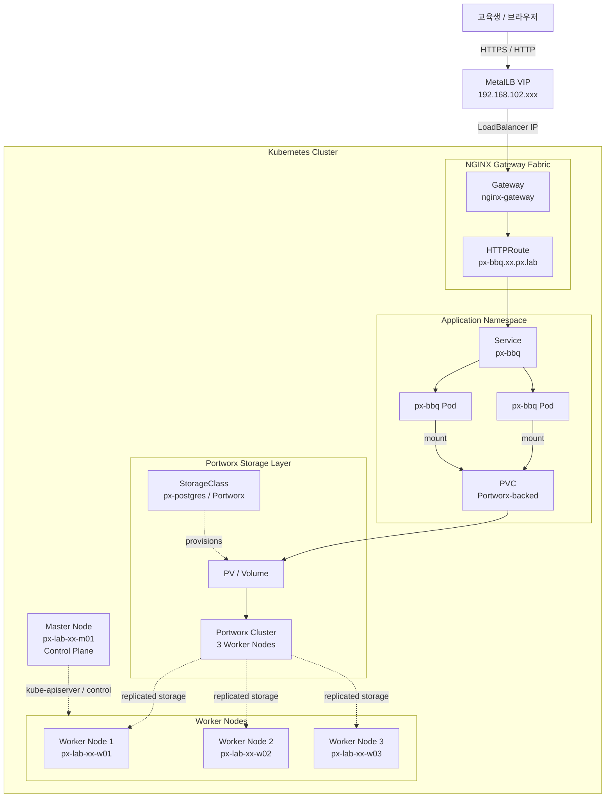

# 교육환경 구성도

Portworx Technical Workshop 교육환경의 기본 구성입니다.

## 구성 요약

- Control Plane: 마스터 노드 1대
- Worker: 워커 노드 3대
- External Access: MetalLB VIP가 `LoadBalancer` 진입점 제공
- Ingress/Gateway: NGINX Gateway Fabric이 `px-bbq` 앱 라우팅
- Application: `px-bbq` 서비스와 Pod가 백엔드 PVC를 마운트
- Storage: Portworx가 PVC/PV를 프로비저닝하고 워커 노드 기반 스토리지 클러스터로 데이터 제공

---

[처음으로](../../README.md) | [Lab 01](./kubernetes-cluster.md)

