# Lab 01. 쿠버네티스 클러스터 구성

### Task 1. Lab 환경 확인

1. 쿠버네티스 클러스터를 구성할 대상 노드와 IP 정보를 확인합니다.

| Role | Hostname | IP | CPU(Core) | Memory(GB) | Disks(GB) | OS Version | User |
| --- | --- | --- | --- | --- | --- | --- | --- |
| 마스터 노드 | px-lab-xx-m01 | 192.168.102.xxx | 4 | 6 | 50 | Rocky 8.10 | root |
| 워커 노드 #1 | px-lab-xx-w01 | 192.168.102.xxx | 4 | 8 | 50/100 | Rocky 8.10 | root |
| 워커 노드 #2 | px-lab-xx-w02 | 192.168.102.xxx | 4 | 8 | 50/100 | Rocky 8.10 | root |
| 워커 노드 #3 | px-lab-xx-w03 | 192.168.102.xxx | 4 | 8 | 50/100 | Rocky 8.10 | root |

### Task 2. 노드 설정

1. 모든 노드에서 호스트명을 지정합니다.

```bash
hostnamectl set-hostname <호스트명>
```

| Role | Hostname |
| --- | --- |
| 마스터 노드 | px-lab-xx-m01 |
| 워커 노드 #1 | px-lab-xx-w01 |
| 워커 노드 #2 | px-lab-xx-w02 |
| 워커 노드 #3 | px-lab-xx-w03 |

2. 모든 노드의 `/etc/hosts` 파일에 노드 정보를 동일하게 등록합니다.

```bash
vi /etc/hosts
```

```text
192.168.102.xx  px-lab-xx-m01
192.168.102.xx  px-lab-xx-w01
192.168.102.xx  px-lab-xx-w02
192.168.102.xx  px-lab-xx-w03
```

| Hostname | IP Address |
| --- | --- |
| px-lab-xx-m01 | 192.168.102.xx |
| px-lab-xx-w01 | 192.168.102.xx |
| px-lab-xx-w02 | 192.168.102.xx |
| px-lab-xx-w03 | 192.168.102.xx |

3. 호스트명으로 통신이 되는지 확인합니다.

```bash
ping px-lab-xx-m01
```
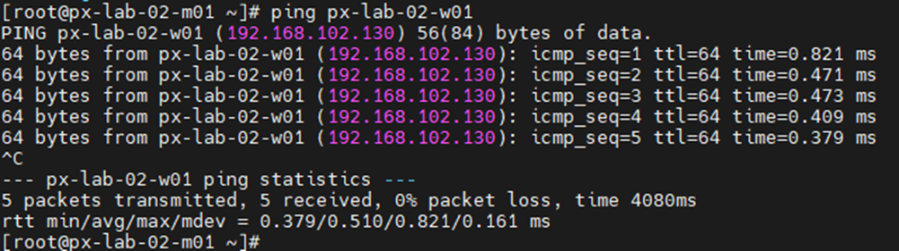

### Task 3. OS 기본 설정

1. 모든 노드에서 OS 패키지를 업데이트하고 재시작합니다.

```bash
dnf update -y
reboot
```

2. 의존성 패키지를 설치합니다.

```bash
dnf install -y dnf-utils tar curl dnf-plugins-core lvm2 \
  device-mapper-persistent-data iscsi-initiator-utils device-mapper-multipath
```

3. 방화벽 서비스를 중지하고 비활성화합니다.

```bash
systemctl disable --now firewalld
```

4. Swap을 비활성화합니다.

```bash
swapoff -a
sed -i '/ swap / s/^/#/' /etc/fstab
cat /etc/fstab
```

5. SELinux를 permissive로 변경합니다.

```bash
setenforce 0
sed -i 's/^SELINUX=enforcing$/SELINUX=permissive/' /etc/selinux/config
cat /etc/selinux/config
```
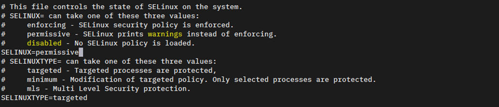

6. 커널 모듈을 로딩하고 재부팅 후에도 적용되도록 설정합니다.

```bash
modprobe overlay
modprobe br_netfilter

cat <<EOF | tee /etc/modules-load.d/k8s.conf
overlay
br_netfilter
EOF
```

7. 커널 파라미터를 설정합니다.

```bash
cat <<EOF | tee /etc/sysctl.d/k8s.conf
net.bridge.bridge-nf-call-ip6tables=1
net.bridge.bridge-nf-call-iptables=1
net.ipv4.ip_forward=1
EOF
```
```
sysctl --system
```

8. NTP 동기화를 위해 Chrony를 설치하고 상태를 확인합니다.

```bash
dnf install -y chrony
systemctl enable --now chronyd
```

```bash
chronyc sources -v
```
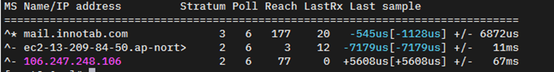
```
timedatectl
```
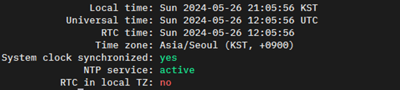

### Task 4. 컨테이너 런타임(Containerd) 설치

1. 모든 노드에서 Docker 저장소를 등록합니다.

```bash
dnf config-manager --add-repo https://download.docker.com/linux/centos/docker-ce.repo
dnf repolist --enabled
```

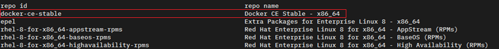

2. Containerd를 설치하고 기본 설정 파일을 생성합니다.

```bash
dnf install -y containerd.io
```
```bash
mkdir -p /etc/containerd
containerd config default > /etc/containerd/config.toml
```

3. `SystemdCgroup` 값을 `true`로 변경합니다.

```bash
sed -i 's/SystemdCgroup = false/SystemdCgroup = true/' /etc/containerd/config.toml
grep 'SystemdCgroup' /etc/containerd/config.toml
```

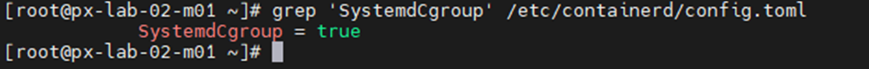
4. Containerd 서비스를 시작하고 상태를 확인합니다.

```bash
systemctl enable --now containerd
systemctl status containerd
```
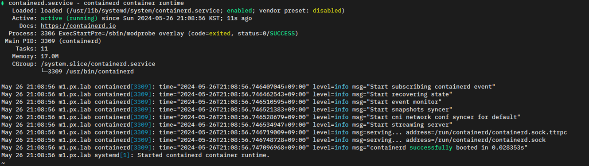
### Task 5. 쿠버네티스 구성 요소 설치

1. 모든 노드에서 쿠버네티스 저장소를 등록합니다.

```bash
cat <<EOF | tee /etc/yum.repos.d/kubernetes.repo
[kubernetes]
name=Kubernetes
baseurl=https://pkgs.k8s.io/core:/stable:/v1.34/rpm
enabled=1
gpgcheck=1
gpgkey=https://pkgs.k8s.io/core:/stable:/v1.34/rpm/repodata/repomd.xml.key
exclude=kubelet kubeadm kubectl cri-tools kubernetes-cni
EOF
```
```bash
dnf repolist --enabled
```
2. 저장소 등록을 확인 합니다.

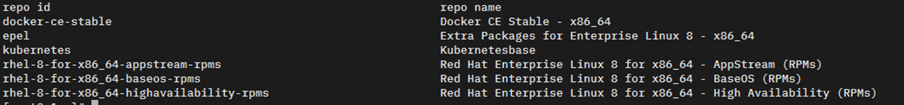

3. 쿠버네티스 구성 요소를 설치합니다.

```bash
dnf install -y kubelet kubeadm kubectl cri-tools --disableexcludes=kubernetes
```
```bash
kubectl version
kubeadm version
```
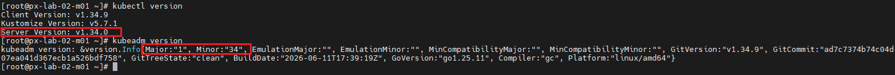

4. Kubelet 서비스를 활성화합니다.

```bash
systemctl enable --now kubelet
systemctl status kubelet
```

> Note: 쿠버네티스 마스터가 구성되지 않아 현재 `kubelet` 서비스는 쿠버네티스 마스터와 통신할 수 없는 상태이므로 실패 상태일 수 있습니다. 다음 Task에서 쿠버네티스 마스터를 구성하면 정상 동작합니다.

### Task 6. 쿠버네티스 마스터 구성

1. 마스터 노드에서 `kubeadm` init yaml를 생성합니다.

```bash
kubeadm config print init-defaults > ~/kubeadm-init.yaml
vi ~/kubeadm-init.yaml
```

2. `kubeadm-init.yaml`에서 아래 항목을 수정합니다.

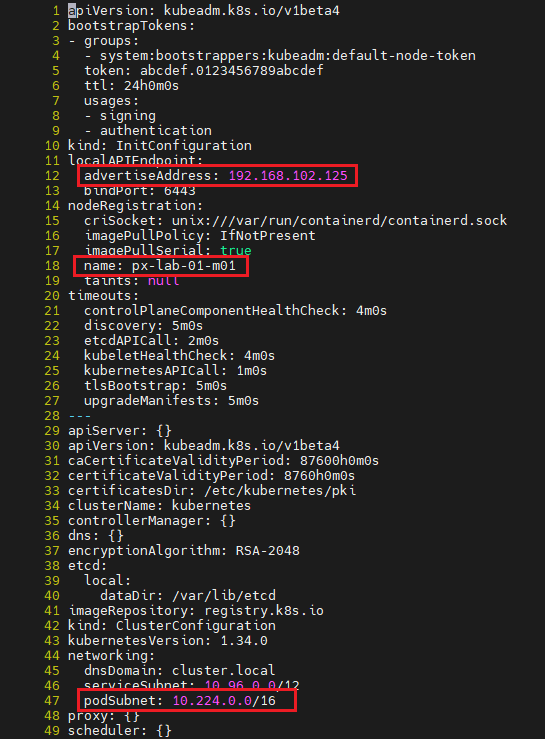

| 항목 | 설명 |
| --- | --- |
| `localAPIEndpoint.advertiseAddress` | 마스터 노드 IP |
| `nodeRegistration.name` | 마스터 노드 호스트명 |
| `networking.podSubnet` | `10.224.0.0/16` |

> Note: `networking.podSubnet` 항목은 신규 추가 항목입니다.

3. 수정한 yaml 파일로 마스터 노드를 초기화합니다.

```bash
kubeadm init --config=kubeadm-init.yaml
```
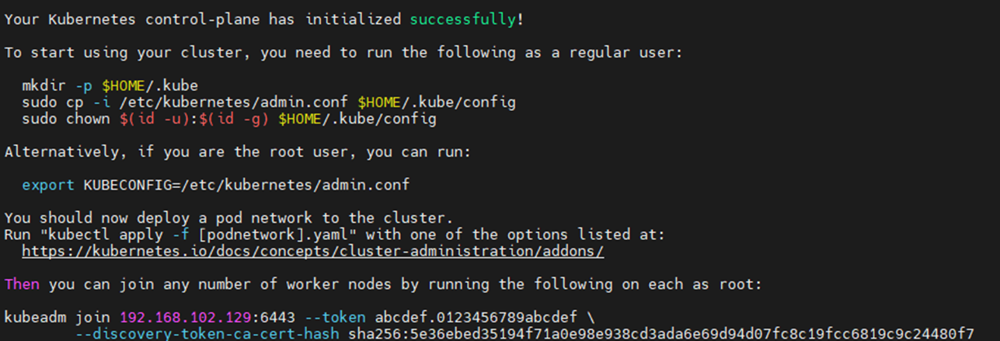

4. `kubectl` 사용 권한을 설정합니다.

```bash
mkdir -p $HOME/.kube
sudo cp -i /etc/kubernetes/admin.conf $HOME/.kube/config
sudo chown $(id -u):$(id -g) $HOME/.kube/config
```

5. 상태를 확인합니다.

```bash
kubectl version --output=yaml
kubectl get nodes
```

### Task 7. 워커 노드 조인

1. 마스터 노드에서 Join 명령어를 생성합니다.

```bash
kubeadm token create --print-join-command
```

> Note: 생성된 토큰은 24시간 후 초기화됩니다.

2. 워커 노드에서 생성된 Join 명령어를 실행합니다.

```bash
kubeadm join 192.168.102.129:6443 \
  --token <token> \
  --discovery-token-ca-cert-hash sha256:<hash>
```

3. 마스터 노드에서 노드 목록을 확인합니다.

```bash
kubectl get nodes
```

> Note: 워커 노드 조인을 하지 않은 시점에는 마스터 노드만 확인할 수 있습니다.

### Task 8. Calico CNI 배포

1. 마스터 노드에서 Calico를 배포합니다.

```bash
kubectl apply -f https://raw.githubusercontent.com/projectcalico/calico/v3.32.0/manifests/calico.yaml
kubectl get po -A
kubectl get nodes
```

> Note: CNI가 배포되기 전에는 노드 상태가 `NotReady`일 수 있습니다.
>
> Note: 진행 과정을 모니터링하려면 `watch -n 1 kubectl get po -A`를 실행합니다.

2. 모든 Pod가 `Running`, 모든 노드가 `Ready` 상태인지 확인합니다.

### Task 9. 테스트용 NGINX 배포

1. 네임스페이스를 생성합니다.

```bash
cat <<EOF | kubectl apply -f -
apiVersion: v1
kind: Namespace
metadata:
  name: lab
EOF
```

2. Deployment YAML을 생성합니다.

```bash
vi ~/nginx-app.yaml
```

```yaml
apiVersion: apps/v1
kind: Deployment
metadata:
  name: nginx-server
  labels:
    app: server
spec:
  replicas: 1
  selector:
    matchLabels:
      app: server
  template:
    metadata:
      name: nginx-server
      labels:
        app: server
    spec:
      containers:
        - name: server
          image: nginx:latest
          ports:
            - containerPort: 80
```

3. 애플리케이션을 배포합니다.

```bash
kubectl apply -f ~/nginx-app.yaml --namespace=lab
```

4. Service YAML을 생성합니다.

```bash
vi ~/nginx-svc.yaml
```

```yaml
apiVersion: v1
kind: Service
metadata:
  name: nginx-service
  labels:
    app: server
spec:
  selector:
    app: server
  ports:
    - protocol: TCP
      port: 80
      targetPort: 80
---
apiVersion: v1
kind: Service
metadata:
  name: nginx-service-node
  labels:
    app: server
spec:
  selector:
    app: server
  type: NodePort
  ports:
    - protocol: TCP
      port: 80
      targetPort: 80
      nodePort: 30080
```

5. 서비스를 배포하고 상태를 확인합니다.

```bash
kubectl apply -f ~/nginx-svc.yaml --namespace=lab
kubectl get all -n lab
```

6. 웹 브라우저에서 접속을 확인합니다.

```text
http://<마스터_노드_IP>:30080
```


### Task 10. Helm 설치

1. 마스터 노드에서 Helm을 설치합니다.

```bash
curl -fsSL -o get_helm.sh https://raw.githubusercontent.com/helm/helm/main/scripts/get-helm-3
chmod 700 get_helm.sh
./get_helm.sh
helm version
```
Helm 버전 확인
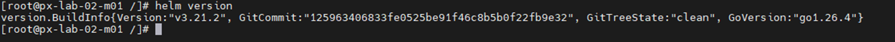
### Task 11. MetalLB 설치

1. Helm 저장소를 추가합니다.

```bash
helm repo add metallb https://metallb.github.io/metallb
helm repo update metallb
helm search repo metallb
```

2. MetalLB를 설치합니다.

```bash
helm upgrade metallb metallb/metallb \
  --version 0.16.1 \
  --install \
  --namespace metallb-system \
  --create-namespace
```
```
watch -n 1 kubectl get all -n metallb-system
```
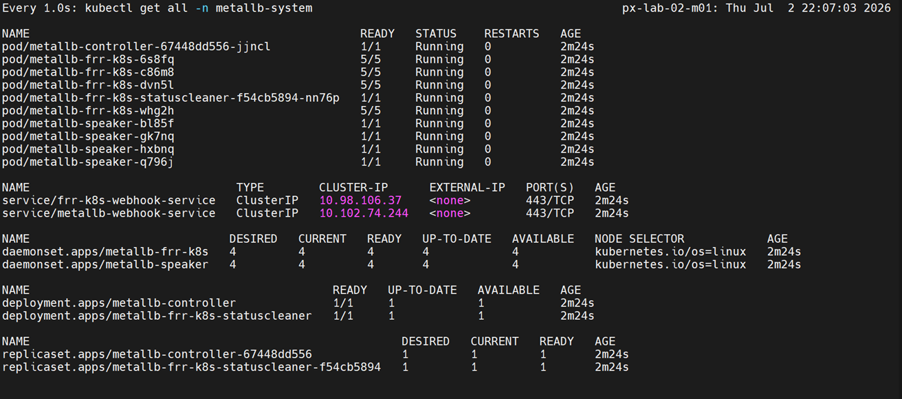

3. MetalLB IP Pool을 생성합니다.

```bash
cat <<EOF > metallb.yaml
apiVersion: metallb.io/v1beta1
kind: IPAddressPool
metadata:
  name: ippool
  namespace: metallb-system
spec:
  addresses:
    - "192.168.102.xxx/32"
  autoAssign: true
---
apiVersion: metallb.io/v1beta1
kind: L2Advertisement
metadata:
  name: default
  namespace: metallb-system
spec:
  ipAddressPools:
    - ippool
  interfaces:
    - ens192
EOF
```
```
kubectl apply -f metallb.yaml
```
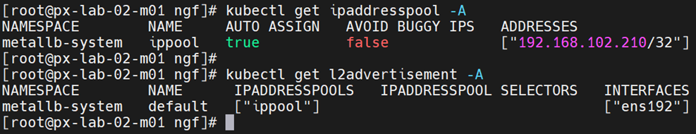
> Note: `192.168.102.xxx/32`의 `xxx`를 자신의 VIP로 변경합니다.

### Task 12. NGINX Gateway Fabric 설치

1. Gateway API 표준 CRD를 설치합니다.

```bash
kubectl apply --server-side -f \
  https://github.com/kubernetes-sigs/gateway-api/releases/download/v1.4.0/standard-install.yaml
```

2. NGINX Gateway Fabric 컨트롤러를 설치합니다.

```bash
helm upgrade --install ngf oci://ghcr.io/nginx/charts/nginx-gateway-fabric \
  --create-namespace \
  -n nginx-gateway \
  --version 2.6.3
```

3. 설치 상태를 확인합니다.

```bash
helm status ngf -n nginx-gateway
kubectl get deploy -n nginx-gateway
kubectl get gatewayclass
```

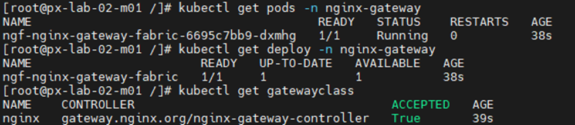

4. HTTPS 접근용 자체 서명 인증서를 생성합니다.

```bash
openssl req -x509 -nodes -newkey rsa:2048 -days 365 \
  -keyout /tmp/px.lab-ngf.key \
  -out /tmp/px.lab-ngf.crt \
  -subj "/CN=*.xx.px.lab" \
  -addext "subjectAltName=DNS:*.xx.px.lab,DNS:xx.px.lab"
```

생성된 인증서 확인
```
openssl x509 -in /tmp/px.lab-ngf.crt -noout -subject -issuer -dates -ext subjectAltName
```


> Note: `xx`를 자신의 Lab 번호로 변경합니다.

5. Secret을 생성합니다.

```bash
kubectl -n nginx-gateway create secret tls px.lab-ngf-tls \
  --cert=/tmp/px.lab-ngf.crt \
  --key=/tmp/px.lab-ngf.key \
  --dry-run=client -o yaml | kubectl apply -f -
```
```
kubectl get secret -n nginx-gateway
```


6. Gateway를 생성합니다.

```bash
cat <<'EOF' > ngf-gateway.yaml
apiVersion: gateway.networking.k8s.io/v1
kind: Gateway
metadata:
  name: nginx-gateway
  namespace: nginx-gateway
spec:
  gatewayClassName: nginx
  listeners:
    - name: http
      port: 80
      protocol: HTTP
      hostname: "*.xx.px.lab"
      allowedRoutes:
        namespaces:
          from: All
    - name: https
      port: 443
      protocol: HTTPS
      hostname: "*.xx.px.lab"
      tls:
        mode: Terminate
        certificateRefs:
          - kind: Secret
            name: px.lab-ngf-tls
      allowedRoutes:
        namespaces:
          from: All
EOF
```
```
kubectl apply -f ngf-gateway.yaml
```

> Note: Gateway YAML의 `xx`도 자신의 Lab 번호로 변경합니다.

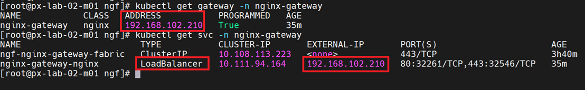

7. HTTPRoute를 생성합니다.

```bash
cat <<'EOF' > nginx-route.yaml
apiVersion: gateway.networking.k8s.io/v1
kind: HTTPRoute
metadata:
  name: nginx-route
  namespace: lab
spec:
  parentRefs:
    - name: nginx-gateway
      namespace: nginx-gateway
      sectionName: http
    - name: nginx-gateway
      namespace: nginx-gateway
      sectionName: https
  hostnames:
    - web.xx.px.lab
  rules:
    - matches:
        - path:
            type: PathPrefix
            value: /
      backendRefs:
        - name: nginx-service
          port: 80
EOF
```
```
kubectl apply -f nginx-route.yaml
```

> Note: HTTPRoute YAML의 `xx`도 자신의 Lab 번호로 변경합니다.


---

[처음으로](../../README.md) | [다음 LAB](../lab-02/px-central-spec-generator.md)


