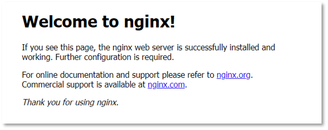
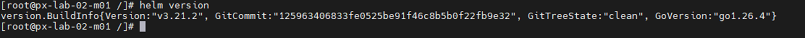
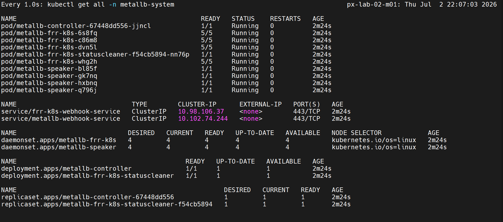
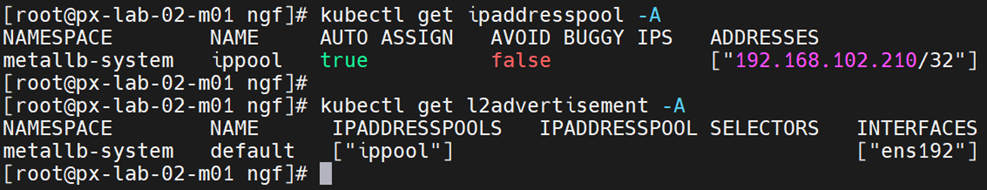
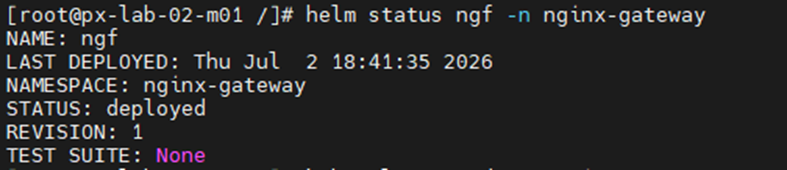
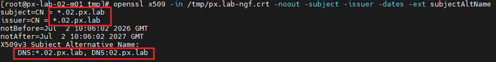
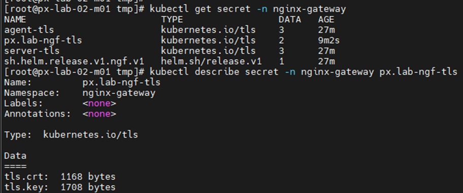
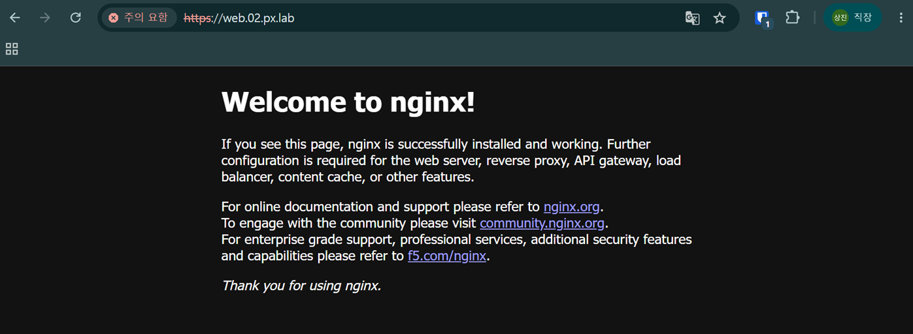

# Lab 02. 쿠버네티스 애플리케이션 및 네트워크 구성

### Task 9. 테스트용 NGINX 배포

1. 네임스페이스를 생성합니다.

```bash
cat <<EOF | kubectl apply -f -
apiVersion: v1
kind: Namespace
metadata:
  name: lab
EOF
```

2. Deployment YAML을 생성합니다.

```bash
vi ~/nginx-app.yaml
```

```yaml
apiVersion: apps/v1
kind: Deployment
metadata:
  name: nginx-server
  labels:
    app: server
spec:
  replicas: 1
  selector:
    matchLabels:
      app: server
  template:
    metadata:
      name: nginx-server
      labels:
        app: server
    spec:
      containers:
        - name: server
          image: nginx:latest
          ports:
            - containerPort: 80
```

3. 애플리케이션을 배포합니다.

```bash
kubectl apply -f ~/nginx-app.yaml --namespace=lab
```

4. Service YAML을 생성합니다.

```bash
vi ~/nginx-svc.yaml
```

```yaml
apiVersion: v1
kind: Service
metadata:
  name: nginx-service
  labels:
    app: server
spec:
  selector:
    app: server
  ports:
    - protocol: TCP
      port: 80
      targetPort: 80
---
apiVersion: v1
kind: Service
metadata:
  name: nginx-service-node
  labels:
    app: server
spec:
  selector:
    app: server
  type: NodePort
  ports:
    - protocol: TCP
      port: 80
      targetPort: 80
      nodePort: 30080
```

5. 서비스를 배포하고 상태를 확인합니다.

```bash
kubectl apply -f ~/nginx-svc.yaml --namespace=lab
kubectl get all -n lab
```

6. 웹 브라우저에서 접속을 확인합니다.

```text
http://<마스터_노드_IP>:30080
```



### Task 10. Helm 설치

1. 마스터 노드에서 Helm을 설치합니다.

```bash
curl -fsSL -o get_helm.sh https://raw.githubusercontent.com/helm/helm/main/scripts/get-helm-3
chmod 700 get_helm.sh
./get_helm.sh
helm version
```
Helm 버전 확인

### Task 11. MetalLB 설치

1. Helm 저장소를 추가합니다.

```bash
helm repo add metallb https://metallb.github.io/metallb
helm repo update metallb
helm search repo metallb
```

2. MetalLB를 설치합니다.

```bash
helm upgrade metallb metallb/metallb \
  --version 0.16.1 \
  --install \
  --namespace metallb-system \
  --create-namespace
```
```
watch -n 1 kubectl get all -n metallb-system
```


3. MetalLB IP Pool을 생성합니다.

```bash
cat <<EOF > metallb.yaml
apiVersion: metallb.io/v1beta1
kind: IPAddressPool
metadata:
  name: ippool
  namespace: metallb-system
spec:
  addresses:
    - "192.168.102.xxx/32"
  autoAssign: true
---
apiVersion: metallb.io/v1beta1
kind: L2Advertisement
metadata:
  name: default
  namespace: metallb-system
spec:
  ipAddressPools:
    - ippool
  interfaces:
    - ens192
EOF
```
```
kubectl apply -f metallb.yaml
```

> Note: `192.168.102.xxx/32`의 `xxx`를 자신의 VIP로 변경합니다.

### Task 12. NGINX Gateway Fabric 설치

1. Gateway API 표준 CRD를 설치합니다.

```bash
kubectl apply --server-side -f \
  https://github.com/kubernetes-sigs/gateway-api/releases/download/v1.4.0/standard-install.yaml
```

2. NGINX Gateway Fabric 컨트롤러를 설치합니다.

```bash
helm upgrade --install ngf oci://ghcr.io/nginx/charts/nginx-gateway-fabric \
  --create-namespace \
  -n nginx-gateway \
  --version 2.6.3
```

3. 설치 상태를 확인합니다.

```bash
helm status ngf -n nginx-gateway
kubectl get deploy -n nginx-gateway
kubectl get gatewayclass
```



4. HTTPS 접근용 자체 서명 인증서를 생성합니다.

```bash
openssl req -x509 -nodes -newkey rsa:2048 -days 365 \
  -keyout /tmp/px.lab-ngf.key \
  -out /tmp/px.lab-ngf.crt \
  -subj "/CN=*.xx.px.lab" \
  -addext "subjectAltName=DNS:*.xx.px.lab,DNS:xx.px.lab"
```

생성된 인증서 확인
```
openssl x509 -in /tmp/px.lab-ngf.crt -noout -subject -issuer -dates -ext subjectAltName
```


> Note: `xx`를 자신의 Lab 번호로 변경합니다.

5. Secret을 생성합니다.

```bash
kubectl -n nginx-gateway create secret tls px.lab-ngf-tls \
  --cert=/tmp/px.lab-ngf.crt \
  --key=/tmp/px.lab-ngf.key \
  --dry-run=client -o yaml | kubectl apply -f -
```
```
kubectl get secret -n nginx-gateway
```



6. Gateway를 생성합니다.

```bash
cat <<'EOF' > ngf-gateway.yaml
apiVersion: gateway.networking.k8s.io/v1
kind: Gateway
metadata:
  name: nginx-gateway
  namespace: nginx-gateway
spec:
  gatewayClassName: nginx
  listeners:
    - name: http
      port: 80
      protocol: HTTP
      hostname: "*.xx.px.lab"
      allowedRoutes:
        namespaces:
          from: All
    - name: https
      port: 443
      protocol: HTTPS
      hostname: "*.xx.px.lab"
      tls:
        mode: Terminate
        certificateRefs:
          - kind: Secret
            name: px.lab-ngf-tls
      allowedRoutes:
        namespaces:
          from: All
EOF
```
```
kubectl apply -f ngf-gateway.yaml
```

> Note: Gateway YAML의 `xx`도 자신의 Lab 번호로 변경합니다.


7. HTTPRoute를 생성합니다.

```bash
cat <<'EOF' > nginx-route.yaml
apiVersion: gateway.networking.k8s.io/v1
kind: HTTPRoute
metadata:
  name: nginx-route
  namespace: lab
spec:
  parentRefs:
    - name: nginx-gateway
      namespace: nginx-gateway
      sectionName: http
    - name: nginx-gateway
      namespace: nginx-gateway
      sectionName: https
  hostnames:
    - web.xx.px.lab
  rules:
    - matches:
        - path:
            type: PathPrefix
            value: /
      backendRefs:
        - name: nginx-service
          port: 80
EOF
```
```
kubectl apply -f nginx-route.yaml
```

> Note: HTTPRoute YAML의 `xx`도 자신의 Lab 번호로 변경합니다.



---

[처음으로](../../README.md) | [이전 LAB](../lab-01/kubernetes-cluster.md) | [다음 LAB](../lab-03/px-central-spec-generator.md)
