# Lab 03. PX-Central을 이용한 Portworx Spec 생성

이 LAB에서는 Portworx Central의 Spec Generator를 이용해 실습 환경에 맞는 Portworx 배포 사양을 생성합니다.
쿠버네티스 버전, 디스크, 네트워크 및 주요 기능을 설정하고 다음 LAB에서 사용할 Spec을 저장합니다.

### Task 1. Portworx Central 계정 만들기

1. 웹 브라우저에서 `central.portworx.com`에 접속하고 메인 화면에서 `Create account`를 선택하여 계정 생성 화면으로 이동합니다.
<p align="center">
  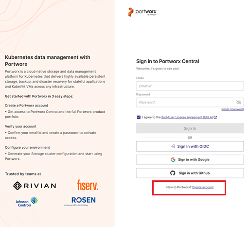
</p>

<p align="center">
  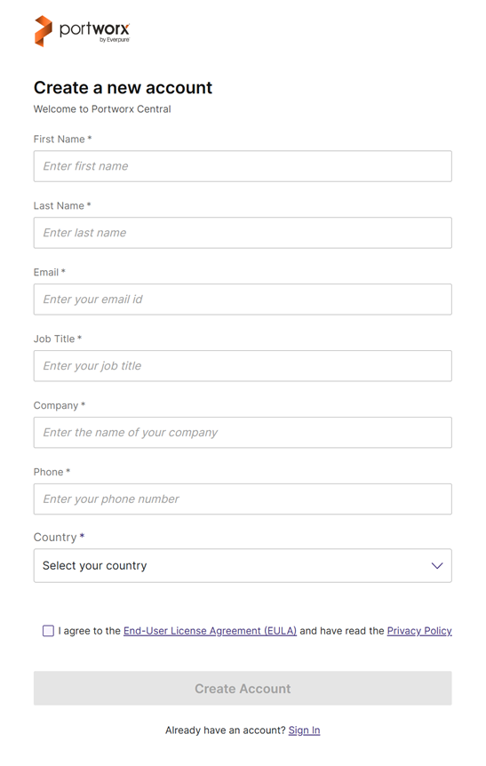
</p>
2. 계정 정보를 입력하고 계정을 생성합니다.


### Task 2. Spec Generator 고급 모드

1. 생성한 계정으로 로그인하고 `Spec List > Portworx Enterprise`를 선택합니다.
<p align="center">
  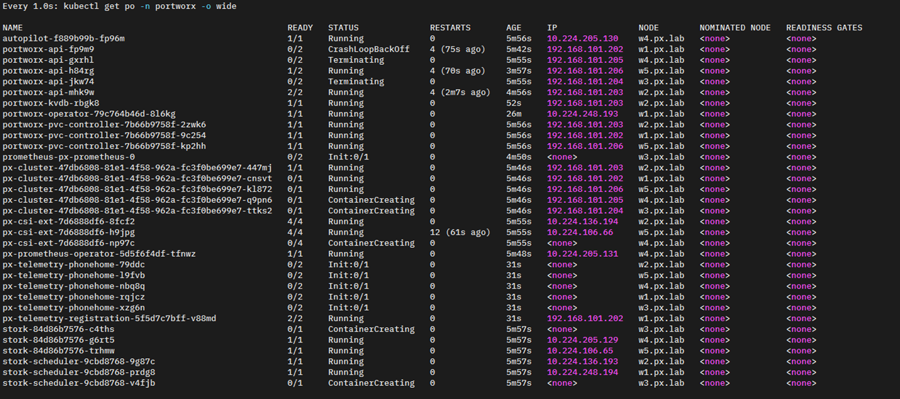
</p>

<p align="center">
  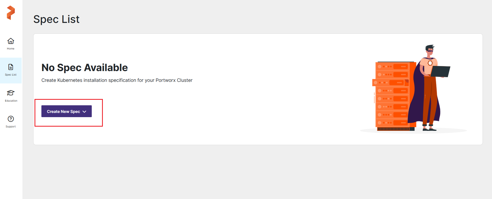
</p>

<p align="center">
  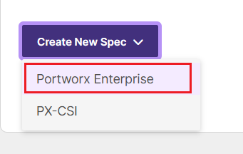
</p>
2. `Generate Spec > Step 1: Select Your Platform`에서 아래 표를 참고하여 항목을 입력한 뒤 화면 아래의 `Customize`를 선택합니다.


| 단계 | 항목 | 값 |
| --- | --- | --- |
| Step 1: Select Your Platform | Portworx Version | 3.6 |
| Step 1: Select Your Platform | Platform | DAS/SAN |
| Step 1: Select Your Platform | Metadata Path | 공란 |
| Step 2: Select Kubernetes Distribution | Distribution Name | OpenShift 4+ |
| Step 2: Select Kubernetes Distribution | Namespace | portworx |

<p align="center">
  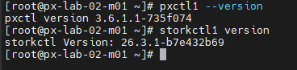
</p>

<p align="center">
  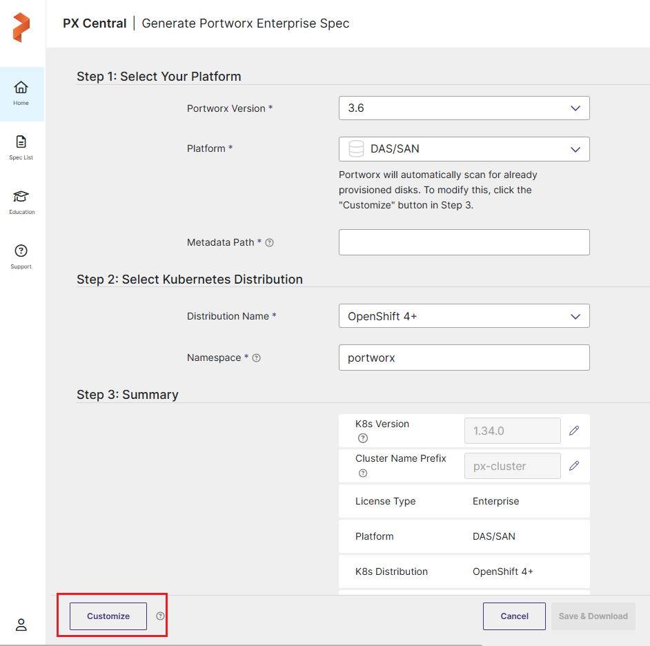
</p>


### Task 3. Spec Generator 고급 모드 - Basic

1. 아래 표를 참고하여 각 항목을 입력하고 `Next`를 선택합니다.

| 항목 | 값 |
| --- | --- |
| Portworx Version | 3.6 |
| Kubernetes Version | 1.34.0 |
| Namespace | portworx |
| etcd | Built-in |


<p align="center">
  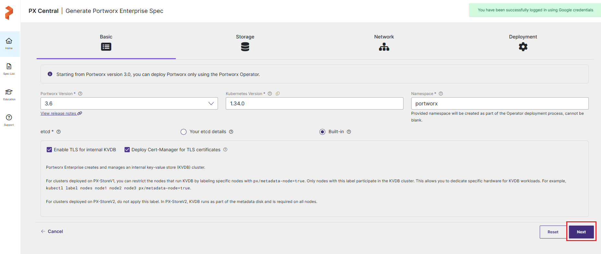
</p>

> Note:
> - `Enable TLS for internal KVDB`: KVDB 노드 간 통신과 Portworx에서 KVDB로 연결하는 통신을 암호화합니다.
> - `Deploy Cert-Manager for TLS certificates`: Portworx Operator가 cert-manager를 설치하고 TLS 인증서를 관리합니다. 클러스터에 cert-manager가 이미 있으면 선택을 해제합니다.
>
> 쿠버네티스 버전은 마스터 노드에서 아래 명령어로 확인합니다.
> ```bash
> kubectl version
> ```

### Task 4. Spec Generator 고급 모드 - Storage

1. 아래 표를 참고하여 각 항목을 입력하고 `Next`를 선택합니다.

| 항목 | 값 |
| --- | --- |
| Select your environment | On Premises |
| Select type of OnPrem storage | Manually specify disks |
| PX-StoreV2 | 체크 해제 |
| Drive/Device | `/dev/sdb` (50GB) |
| Journal Device | None |
| Skip KVDB device | 체크 |
| KVDB device | `/dev/sdb` |

<p align="center">
  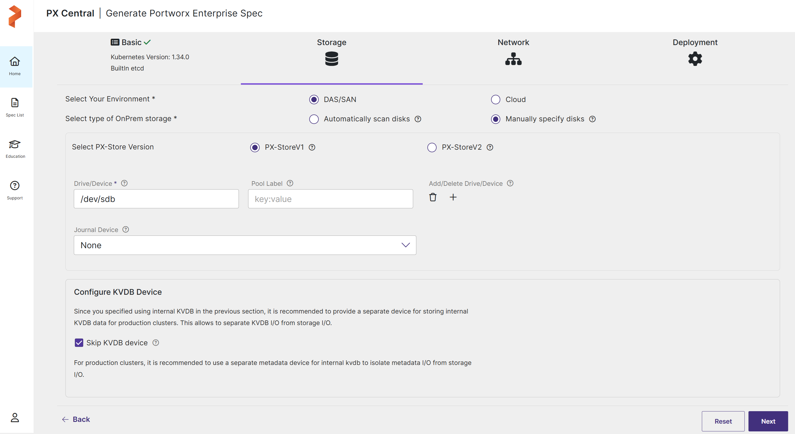
</p>

> Note: KVDB는 Portworx 클러스터 상태와 설정, 볼륨 및 스냅샷 메타데이터를 저장합니다. `Skip KVDB device`를 선택하면 데이터 디스크를 KVDB와 공유하므로 실습 환경에는 적합하지만 운영 환경에는 권장하지 않습니다. 운영 환경에서는 선택을 해제하고 3개 노드에 전용 KVDB 디스크를 구성합니다.

> Note: 이 실습에서는 `PX-StoreV2`를 선택하지 않고 PX-StoreV1을 사용합니다. PX-StoreV1은 범용 환경을 위한 파일시스템 기반 데이터스토어이고, PX-StoreV2는 NVMe급 장치를 사용하는 고성능 I/O 환경에 최적화된 블록 기반 데이터스토어입니다. PX-StoreV2는 노드당 최소 8 CPU Core와 8GB RAM이 필요하며, Portworx 메타데이터를 저장할 64GB 이상의 사전 준비된 `Metadata Path`도 필요합니다. 현재 실습 환경은 워커 노드당 4 CPU Core와 50GB 데이터 디스크로 구성되어 PX-StoreV2의 최소 요구사항을 충족하지 않습니다. 이번 실습에서 확인할 기본 볼륨 생성, 연결 및 데이터 영속성 동작은 PX-StoreV1으로 동일하게 학습할 수 있으므로 PX-StoreV1을 사용합니다.


### Task 5. Spec Generator 고급 모드 - Network

1. 아래 표를 참고하여 각 항목을 입력하고 `Next`를 선택합니다.

| 그룹 항목 | 항목 | 값 |
| --- | --- | --- |
| Interfaces(s) | Data Network Interface | ens224 (10.10.10.x) |
| Interfaces(s) | Management Network Interface | ens192 (192.168.102.x) |
| Advanced Settings | Starting port for Portworx services | 17001 |

<p align="center">
  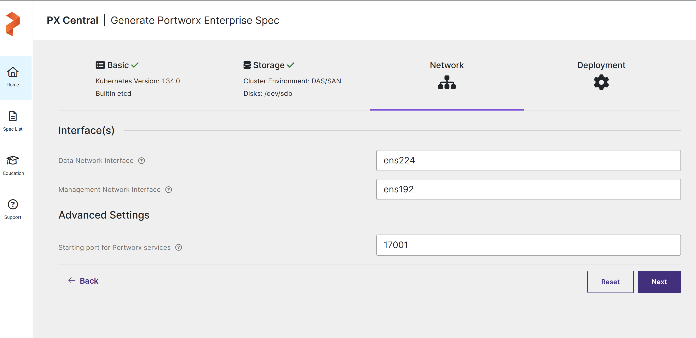
</p>

### Task 6. Spec Generator 고급 모드 - Customize

1. 아래 표를 참고하여 각 항목을 입력하고 `Finish`를 선택합니다.

| 그룹 항목 | 항목 | 값 |
| --- | --- | --- |
| Customize | Are you running on either of these? | None |
| Component Settings | Enable Stork | 체크 |
| Component Settings | Restrict Data Protection RBAC | 체크 해제 |
| Component Settings | Enable Monitoring | 체크 |
| Component Settings | Portworx Managed | 체크 |
| Component Settings | Enable Autopilot | 체크 |

<p align="center">
  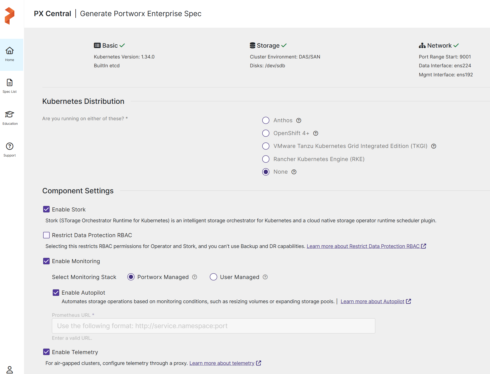
</p>

> Note:
> - `Enable Stork`: Pod를 데이터가 있는 노드에 배치하고 스냅샷 및 애플리케이션 마이그레이션 기능을 제공합니다.
> - `Enable Monitoring`: Portworx 구성 요소와 리소스를 모니터링합니다. `Portworx Managed`를 선택하면 Prometheus와 Operator도 Portworx가 관리합니다.
> - `Enable Autopilot`: 모니터링 지표를 기준으로 PVC 및 스토리지 풀 확장 같은 작업을 자동화합니다.
> - `Enable Telemetry`: 클러스터 상태와 사용량 정보를 Pure1로 전송하여 모니터링과 문제 분석에 활용합니다.

2. Cluster Name, Secrets Store Type을 확인하고 Finish 버튼을 선택 합니다.

<p align="center">
  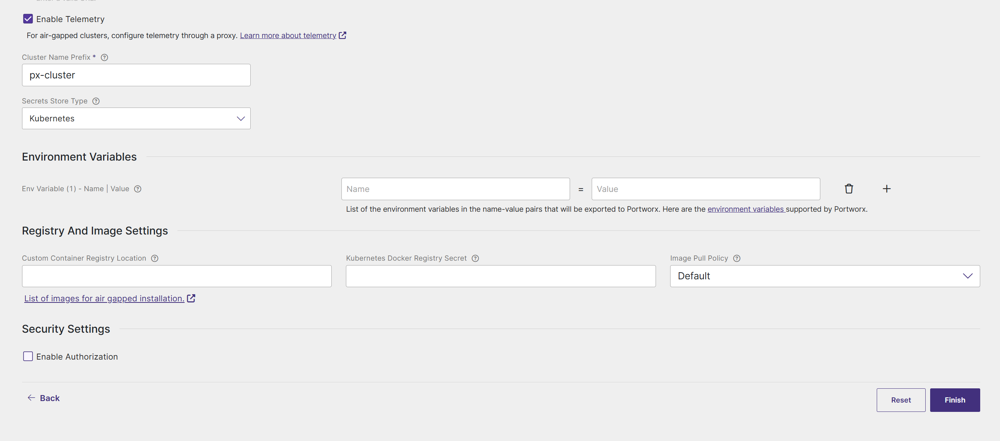
</p>

### Task 7. Spec Generator 저장

1. `Spec Name`과 `Spec Tags`를 입력하고 `Download Specs`과 `Save Spec`을 선택합니다.
2. `Cluster Name`과 `Secrets Store Type`을 확인하고 `Finish`를 선택합니다.
3. 저장된 Spec을 확인합니다.

<p align="center">
  
</p>

## 참고 자료

- [Portworx Enterprise 설치 개요](https://docs.portworx.com/portworx-enterprise/platform/install)
- [Portworx Central을 이용한 Bare Metal Kubernetes 설치](https://docs.portworx.com/portworx-enterprise/platform/install/bare-metal/kubernetes-non-airgap/operator)
- [StorageCluster CRD 레퍼런스](https://docs.portworx.com/portworx-enterprise/reference/crd/storage-cluster/)
- [PX-StoreV1과 PX-StoreV2 비교](https://docs.portworx.com/portworx-enterprise/concepts/px-store-v2)
- [Portworx 시스템 요구사항](https://docs.portworx.com/portworx-enterprise/platform/prerequisites)

---

[처음으로](../../README.md) | [이전 LAB](../lab-02/kubernetes-addons.md) | [다음 LAB](../lab-04/portworx-deployment.md)
