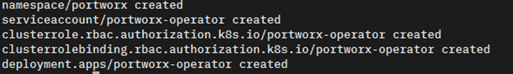
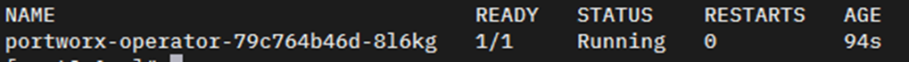
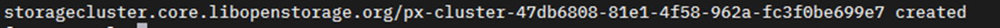
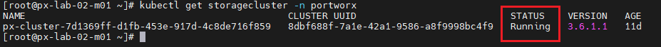
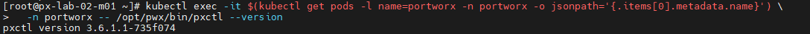

# Lab 04. 쿠버네티스 클러스터에 Portworx 배포

이 LAB에서는 Portworx Operator와 이전 LAB에서 만든 Spec을 사용해 쿠버네티스 클러스터에 Portworx를 배포합니다.
배포된 구성 요소와 클러스터 상태를 확인하고 운영에 사용할 `pxctl` 및 `storkctl` 명령어 별칭을 등록합니다.

### Task 1. Portworx Operator 배포

1. 마스터 노드에서 `px-operator`를 배포합니다.

```bash
kubectl apply -f 'https://install.portworx.com/3.6?comp=pxoperator&kbver=1.34.0&ns=portworx'
```



2. 파드 상태를 확인 합니다.
```
kubectl get po -n portworx
```


### Task 2. Portworx 배포

1. `central.portworx.com`에 접속합니다.
2. `Install and Run` 메뉴로 이동합니다.
3. 생성한 Spec 목록을 확인합니다.
4. 목록의 `Action` 버튼을 클릭합니다.
5. `Copy to Clipboard`를 선택합니다.
6. 복사한 명령어를 쿠버네티스 마스터 노드에서 실행합니다.
```
kubectl apply -f 'https://install.portworx.com/3.6?operator=true&mc=false&kbver=1.34.0&ns=portworx&b=true&kvdbtls=true&certmgr=true&s=%22%2Fdev%2Fsdb%22&m=ens192&d=ens224&c=px-cluster-6a38d0e4-8a51-4a61-9d17-0e13bde727d6&stork=true&csi=true&mon=true&aut=true&tel=true&st=k8s&promop=true'
```



7. 배포 상태를 모니터링합니다.

```bash
watch -n 1 kubectl get po -n portworx -o wide
```


> Note: 배포가 완료되기까지 약 30분 정도 소요됩니다.

8. 배포 완료 후 `px-cluster` Pod를 확인합니다.

```bash
kubectl get po -n portworx | grep px-cluster
```


9. `pxctl` 동작을 확인합니다.

```bash
kubectl exec -it $(kubectl get pods -l name=portworx -n portworx -o jsonpath='{.items[0].metadata.name}') \
  -n portworx -- /opt/pwx/bin/pxctl --version
```


### Task 3. 운영 명령어 Alias 등록

1. 마스터 노드의 `~/.bashrc`에 `pxctl` alias를 등록합니다.
> Note: `xx`를 자신의 Lab 번호로 변경합니다.

```bash
vi ~/.bashrc
```

```bash
export PX_POD1=$(kubectl get pods \
  -n portworx \
  -l name=portworx \
  --field-selector spec.nodeName=px-lab-xx-w01 \
  -o jsonpath='{.items[0].metadata.name}')

export PX_POD2=$(kubectl get pods \
  -n portworx \
  -l name=portworx \
  --field-selector spec.nodeName=px-lab-xx-w02 \
  -o jsonpath='{.items[0].metadata.name}')

export PX_POD3=$(kubectl get pods \
  -n portworx \
  -l name=portworx \
  --field-selector spec.nodeName=px-lab-xx-w03 \
  -o jsonpath='{.items[0].metadata.name}')

alias pxctl1='kubectl exec -it "$PX_POD1" -n portworx -- /opt/pwx/bin/pxctl'
alias pxctl2='kubectl exec -it "$PX_POD2" -n portworx -- /opt/pwx/bin/pxctl'
alias pxctl3='kubectl exec -it "$PX_POD3" -n portworx -- /opt/pwx/bin/pxctl'
```

2. `storkctl` alias를 등록합니다.
> Note: `xx`를 자신의 Lab 번호로 변경합니다.

```bash
export STORK_POD1=$(kubectl get pods \
  -n portworx \
  -l name=stork \
  --field-selector spec.nodeName=px-lab-xx-w01 \
  -o jsonpath='{.items[0].metadata.name}')

export STORK_POD2=$(kubectl get pods \
  -n portworx \
  -l name=stork \
  --field-selector spec.nodeName=px-lab-xx-w02 \
  -o jsonpath='{.items[0].metadata.name}')

export STORK_POD3=$(kubectl get pods \
  -n portworx \
  -l name=stork \
  --field-selector spec.nodeName=px-lab-xx-w03 \
  -o jsonpath='{.items[0].metadata.name}')

alias storkctl1='kubectl exec -it "$STORK_POD1" -n portworx -- /storkctl/linux/storkctl'
alias storkctl2='kubectl exec -it "$STORK_POD2" -n portworx -- /storkctl/linux/storkctl'
alias storkctl3='kubectl exec -it "$STORK_POD3" -n portworx -- /storkctl/linux/storkctl'
```

3. Shell을 재시작하고 명령어를 확인합니다.

```bash
exec $SHELL
pxctl1 --version
storkctl1 version
```


## 참고 자료

- [Portworx Enterprise 설치 개요](https://docs.portworx.com/portworx-enterprise/platform/install)
- [Bare Metal Kubernetes에 Portworx 설치](https://docs.portworx.com/portworx-enterprise/platform/install/bare-metal/kubernetes-non-airgap/operator)
- [StorageCluster CRD 레퍼런스](https://docs.portworx.com/portworx-enterprise/reference/crd/storage-cluster/)

---

[처음으로](../../README.md) | [이전 LAB](../lab-03/px-central-spec-generator.md) | [다음 LAB](../lab-05/portworx-operations.md)
