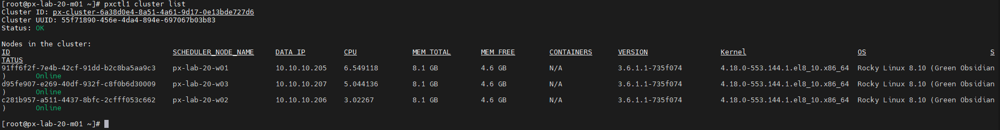
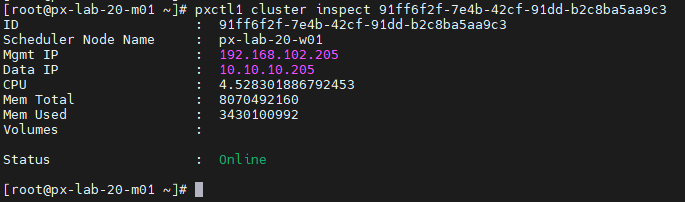
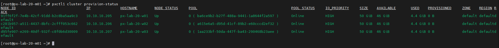
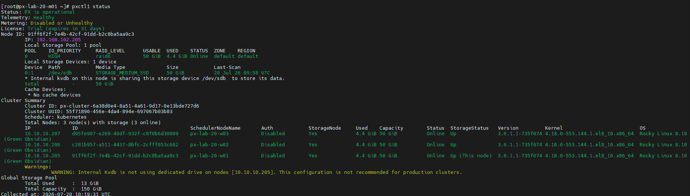
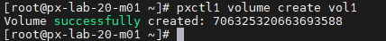
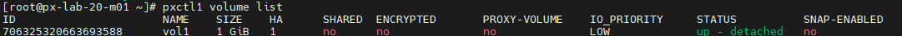
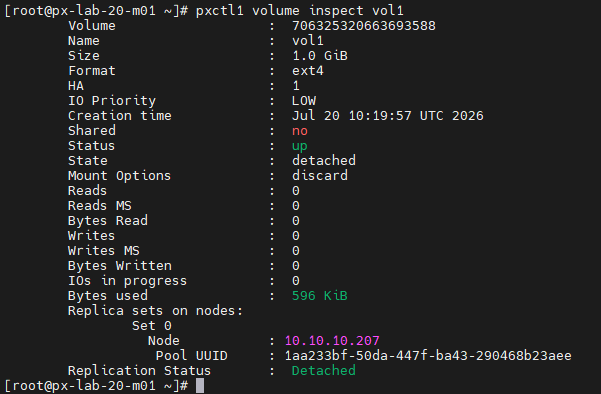

# Lab 05. Portworx 기본 운영

이 LAB에서는 `pxctl`을 이용해 Portworx 클러스터, 노드 및 스토리지 풀 상태를 확인합니다.
테스트 볼륨을 생성하고 조회하면서 Portworx 볼륨의 기본 관리 방법을 익힙니다.

### Task 1. Portworx 클러스터 정보 조회

1. `pxctl1 cluster list` 명령어로 Portworx 클러스터 목록을 확인합니다.

```bash
pxctl1 cluster list
```


2. `pxctl1 cluster inspect <Node_ID>` 명령어로 Portworx 클러스터를 구성하는 첫 번째 워커 노드의 상세 정보를 확인합니다.

```bash
pxctl1 cluster inspect <Node_ID>
```


3. `pxctl1 cluster provision-status` 명령어로 클러스터의 Provision 상태를 확인합니다.

```bash
pxctl1 cluster provision-status
```


4. 클러스터 개요를 확인합니다.

```bash
pxctl1 status
```

### Task 2. Volume 기본 관리

1. `pxctl1 volume create` 명령어로 볼륨을 생성합니다.

```bash
pxctl1 volume create vol1
```



2. `pxctl1 volume list` 명령어로 볼륨 목록을 확인합니다.

```bash
pxctl1 volume list
```


3. `pxctl1 volume inspect` 명령어로 해당 볼륨의 상세 정보를 확인합니다.

```bash
pxctl1 volume inspect vol1
```

## 참고 자료

- [pxctl Volume 레퍼런스](https://docs.portworx.com/portworx-enterprise/reference/cli/pxctl-reference/volume-reference)
- [pxctl로 Volume 상세 정보 확인](https://docs.portworx.com/portworx-enterprise/reference/cli/create-and-manage-volumes/inspect-volumes)
- [pxctl Service 명령](https://docs.portworx.com/portworx-enterprise/reference/cli/service)
- [Portworx Storage Pool 개념](https://docs.portworx.com/portworx-enterprise/concepts/storage-pools)

---

[처음으로](../../README.md) | [이전 LAB](../lab-04/portworx-deployment.md) | [다음 LAB](../lab-06/nginx-lab02-rwo-rwx-bbq.md)
