# Lab 06. LAB 02 NGINX를 이용한 영구·공유 볼륨과 Portworx BBQ

Task 1은 LAB 02에서 생성한 `nginx-server` Deployment, `nginx-service` Service와 `nginx-route` HTTPRoute를 그대로 사용합니다. Task 2는 RWO 애플리케이션을 유지한 채 별도의 RWX Deployment, Service와 HTTPRoute를 추가합니다.

> Note: `app: server` 라벨과 `lab` 네임스페이스를 변경하면 기존 Service와 HTTPRoute가 NGINX Pod를 찾지 못합니다.

### Task 1. 기존 NGINX에 RWO 영구 볼륨 연결

1. LAB 02에서 만든 리소스와 Portworx StorageClass를 확인합니다.

```bash
kubectl get deployment,service,httproute -n lab
kubectl get storageclass px-csi-db
```

2. LAB 02에서 만든 `~/nginx-app.yaml`을 아래 내용으로 수정합니다.

기존 Deployment에 `volumeMounts`와 `volumes`를 추가하고, `---` 아래에 RWO PVC를 추가합니다.

```bash
vi ~/nginx-app.yaml
```

```yaml
apiVersion: apps/v1
kind: Deployment
metadata:
  name: nginx-server
  namespace: lab
  labels:
    app: server
spec:
  replicas: 1
  selector:
    matchLabels:
      app: server
  template:
    metadata:
      labels:
        app: server
    spec:
      containers:
        - name: server
          image: nginx:latest
          ports:
            - containerPort: 80
          # LAB 06에서 추가: PVC를 컨테이너 경로에 연결
          volumeMounts:
            - name: nginx-html
              mountPath: /usr/share/nginx/html
      # LAB 06에서 추가: 사용할 PVC 지정
      volumes:
        - name: nginx-html
          persistentVolumeClaim:
            claimName: nginx-content-rwo
---
# LAB 06에서 추가: RWO PVC 생성
apiVersion: v1
kind: PersistentVolumeClaim
metadata:
  name: nginx-content-rwo
  namespace: lab
spec:
  storageClassName: px-csi-db
  accessModes:
    - ReadWriteOnce
  resources:
    requests:
      storage: 1Gi
```

3. 수정한 YAML을 다시 배포합니다.

```bash
kubectl apply -f ~/nginx-app.yaml
kubectl get pod,pvc -n lab -o wide
```

Portworx 클러스터, 스토리지 풀과 새 볼륨을 확인합니다.

```bash
pxctl1 volume list
pxctl1 volume inspect <VOLUME ID>
```
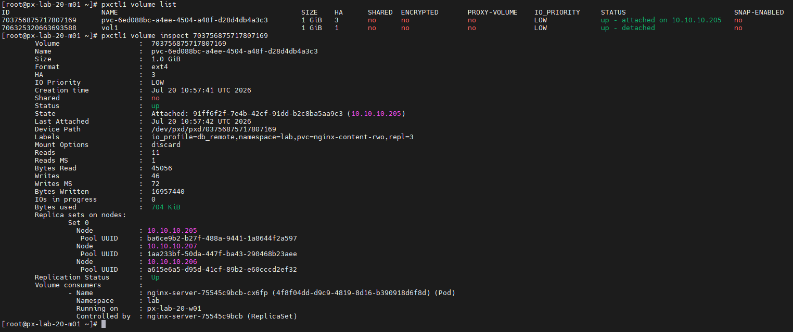

`kubectl get pvc -n lab`의 `VOLUME` 열과 `pxctl1 volume list`의 ID를 비교해 RWO 볼륨을 찾습니다.

4. NGINX Pod 셸에 직접 들어가 `index.html`을 생성합니다.

```bash
kubectl get pod -n lab
kubectl exec -it -n lab <NGINX_POD_NAME> -- /bin/bash
```

`<NGINX_POD_NAME>`을 위에서 확인한 실제 Pod 이름으로 변경합니다.
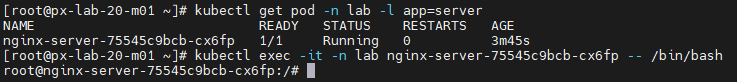

Pod 셸에서 다음 명령을 실행합니다.

```sh
cd /usr/share/nginx/html
echo "Hello World" > index.html
exit
```
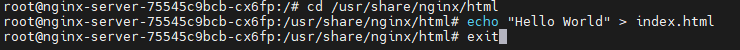

RWO 볼륨의 상세 상태와 연결된 노드를 확인합니다.

```bash
pxctl1 volume inspect VOLUME_ID
```

`VOLUME_ID`를 `pxctl1 volume list`에서 확인한 실제 볼륨 ID로 변경합니다.

5. LAB 02에서 만든 주소로 접속해 변경된 화면을 확인합니다.

```text
http://web.xx.px.lab
```

6. Pod를 삭제한 뒤 새 Pod에서도 내용이 유지되는지 확인합니다.

```bash
kubectl get pod -n lab
kubectl delete pod -n lab <NGINX_POD_NAME>

kubectl get pod -n lab
kubectl exec -n lab <NEW_NGINX_POD_NAME> -- cat /usr/share/nginx/html/index.html
```

`<NGINX_POD_NAME>`과 `<NEW_NGINX_POD_NAME>`은 각 명령 실행 시 확인한 실제 이름으로 변경합니다.

웹 페이지에도 수정한 내용이 남아 있으면 RWO PVC에 데이터가 유지된 것입니다.

#### RWO 볼륨의 다른 노드 연결 제한 확인

1. 현재 NGINX Pod가 실행 중인 노드를 확인합니다.

```bash
kubectl get pod -n lab -o wide
```
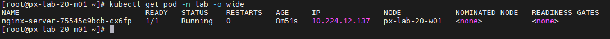
출력의 `NODE` 열에서 노드 이름을 확인한 뒤 해당 노드를 `cordon`합니다.

```bash
kubectl cordon <WORKER_NODE_NAME>
kubectl get nodes
```
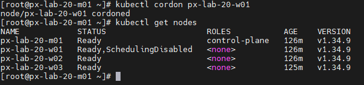


기존 Pod는 계속 실행되지만 새 Pod는 이 노드에 스케줄되지 않습니다.

2. Deployment를 3개로 확장합니다.

```bash
kubectl scale deploy nginx-server -n lab --replicas=3
kubectl get pod -n lab -o wide -w
```
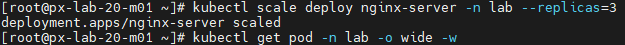

새 Pod는 다른 노드에 배치되지만 기존 Pod가 사용 중인 RWO 볼륨을 연결하지 못해 `Pending` 또는 `ContainerCreating` 상태에 머물 수 있습니다.
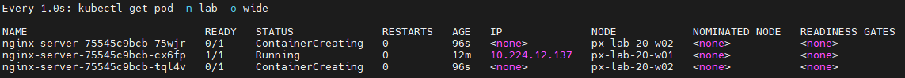

3. 새 Pod의 이벤트에서 Multi-Attach 오류를 확인합니다.

```bash
kubectl get pod -n lab -o wide
kubectl describe pod -n lab <PENDING_POD_NAME>
```
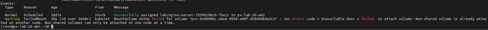

`PENDING_POD_NAME`을 새로 생성된 Pending Pod 이름으로 변경합니다.

`Multi-Attach error` 또는 볼륨 Attach 실패 이벤트가 표시되면 RWO 볼륨은 한 번에 하나의 노드에서만 Read/Write로 연결된다는 것을 확인한 것입니다.

Portworx에서도 볼륨이 기존 노드에 연결되어 있고 스토리지 풀이 정상인지 확인합니다.

```bash
pxctl1 volume inspect <VOLUME_ID>
```
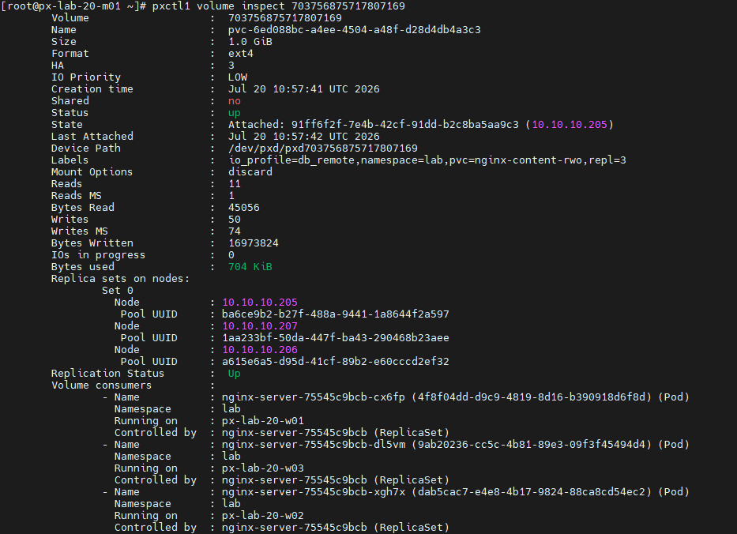

4. Deployment를 다시 1개로 줄이고 노드의 `cordon`을 해제합니다.

```bash
kubectl scale deployment/nginx-server -n lab --replicas=1
kubectl uncordon WORKER_NODE_NAME
kubectl get nodes
kubectl get pod -n lab -o wide
```

`WORKER_NODE_NAME`은 앞에서 `cordon`한 실제 노드 이름으로 변경합니다.

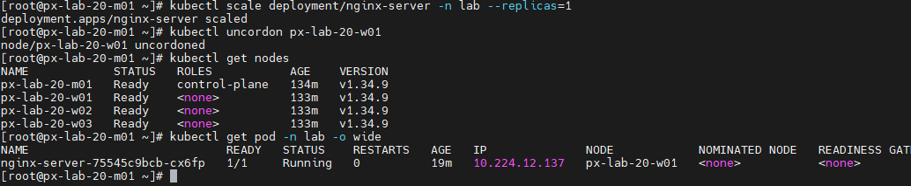

### Task 2. 별도 NGINX와 RWX 공유 볼륨 생성

1. 모든 Portworx 워커 노드에서 Sharedv4에 필요한 패키지를 준비합니다.

```bash
dnf install -y nfs-utils
systemctl enable --now rpcbind
```

2. Task 1의 RWO 애플리케이션이 그대로 실행 중인지 확인합니다.

```bash
kubectl get deployment nginx-server -n lab
kubectl get pvc nginx-content-rwo -n lab
curl http://web.xx.px.lab
```

3. 별도 파일인 `~/nginx-rwx.yaml`을 생성합니다.

Task 1과 겹치지 않도록 Deployment 이름은 `nginx-server-rwx`, 라벨은 `app: server-rwx`를 사용합니다. RWX 애플리케이션 전용 Service도 함께 생성합니다.

```bash
vi ~/nginx-rwx.yaml
```

```yaml
apiVersion: apps/v1
kind: Deployment
metadata:
  name: nginx-server-rwx
  namespace: lab
  labels:
    app: server-rwx
spec:
  replicas: 3
  selector:
    matchLabels:
      app: server-rwx
  template:
    metadata:
      labels:
        app: server-rwx
    spec:
      containers:
        - name: server
          image: nginx:latest
          ports:
            - containerPort: 80
          # RWX PVC를 컨테이너 경로에 연결
          volumeMounts:
            - name: nginx-html
              mountPath: /usr/share/nginx/html
      volumes:
        - name: nginx-html
          persistentVolumeClaim:
            claimName: nginx-content-rwx
---
apiVersion: storage.k8s.io/v1
kind: StorageClass
metadata:
  name: px-nginx-rwx
provisioner: pxd.portworx.com
parameters:
  repl: "3"
  sharedv4: "true"
  sharedv4_svc_type: "ClusterIP"
allowVolumeExpansion: true
---
apiVersion: v1
kind: PersistentVolumeClaim
metadata:
  name: nginx-content-rwx
  namespace: lab
spec:
  storageClassName: px-nginx-rwx
  accessModes:
    - ReadWriteMany
  resources:
    requests:
      storage: 2Gi
---
apiVersion: v1
kind: Service
metadata:
  name: nginx-rwx-service
  namespace: lab
spec:
  selector:
    app: server-rwx
  ports:
    - port: 80
      targetPort: 80
```

위 내용을 `~/nginx-rwx.yaml`에 저장합니다.

4. 별도 RWX 구성을 배포합니다.

```bash
kubectl apply -f ~/nginx-rwx.yaml
kubectl get pod,pvc,service -n lab -o wide
```
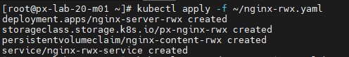
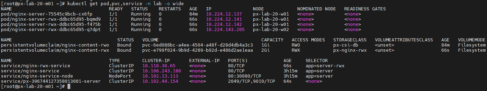

세 Pod가 모두 `Running` 상태인지와 어느 노드에 배치되었는지 확인합니다.

Portworx에서 새 RWX 볼륨과 스토리지 풀 상태를 확인합니다.

```bash
pxctl1 volume list
pxctl1 volume inspect <RWX_VOLUME_ID>
```
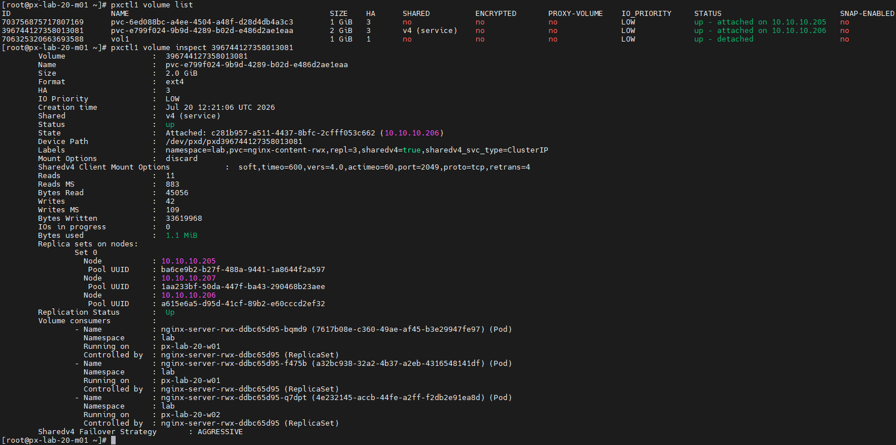

`RWX_VOLUME_ID`를 `pxctl1 volume list`에서 확인한 실제 RWX 볼륨 ID로 변경합니다.

5. RWX 애플리케이션 전용 HTTPRoute를 생성합니다.

```bash
vi ~/nginx-rwx-route.yaml
```
>Note: `xx`를 자신의 LAB 번호로 변경한 뒤 적용합니다.

```yaml
apiVersion: gateway.networking.k8s.io/v1
kind: HTTPRoute
metadata:
  name: nginx-rwx-route
  namespace: lab
spec:
  parentRefs:
    - name: nginx-gateway
      namespace: nginx-gateway
      sectionName: http
    - name: nginx-gateway
      namespace: nginx-gateway
      sectionName: https
  hostnames:
    - rwx-web.xx.px.lab
  rules:
    - backendRefs:
        - name: nginx-rwx-service
          port: 80
```


```bash
kubectl apply -f ~/nginx-rwx-route.yaml
kubectl get httproute -n lab
```
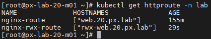

6. 첫 번째 RWX Pod 셸에 들어가 공유 `index.html`을 생성합니다.

```bash
kubectl get pod -n lab -l app=server-rwx -o wide
kubectl exec -it -n lab <FIRST_RWX_POD_NAME> -- /bin/bash
```

`<FIRST_RWX_POD_NAME>`을 첫 번째 실제 RWX Pod 이름으로 변경합니다.
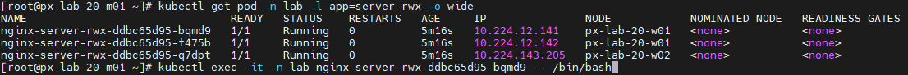
Pod 셸에서 다음 명령을 실행합니다.

```sh
cd /usr/share/nginx/html
echo "Hello RWX" > index.html
exit
```
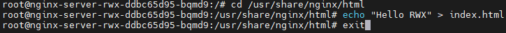
7. 마스터 노드에서 각 RWX Pod IP로 직접 접속합니다.

```bash
kubectl get pod -n lab -l app=server-rwx -o wide

curl http://POD_IP_1
curl http://POD_IP_2
curl http://POD_IP_3
curl http://rwx-web.xx.px.lab
```
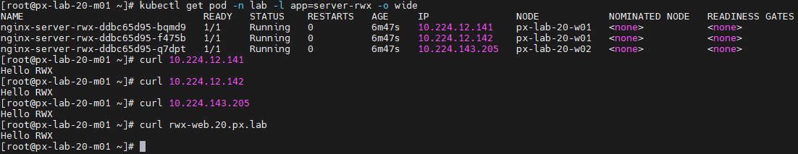
`POD_IP_1`부터 `POD_IP_3`까지를 출력의 `IP` 열에 표시된 실제 Pod IP로 변경합니다. 서로 다른 세 Pod가 모두 `Hello RWX`를 반환하면 같은 RWX PVC의 `index.html`을 읽고 있는 것입니다.

8. 두 번째 Pod에서 파일을 다시 수정합니다.

```bash
kubectl exec -it -n lab <SECOND_RWX_POD_NAME> -- /bin/bash
```

Pod 셸에서 다음 명령을 실행합니다.

```sh
cd /usr/share/nginx/html
echo "Changed by Second Pod" > index.html
exit
```

앞에서 확인한 세 Pod IP에 다시 접속합니다.

```bash
curl http://POD_IP_1
curl http://POD_IP_2
curl http://POD_IP_3
curl http://rwx-web.xx.px.lab
```
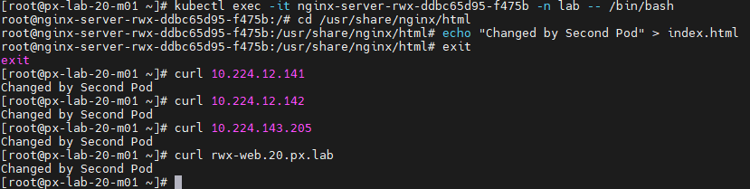

세 Pod가 모두 `Changed by Second Pod`를 반환하면 한 Pod에서 수정한 파일이 공유 볼륨을 사용하는 모든 Pod에 즉시 반영된 것입니다.


9. RWX Deployment를 10개로 확장합니다.

```bash
kubectl scale deployment/nginx-server-rwx -n lab --replicas=10
kubectl get pod -n lab -l app=server-rwx -o wide
pxctl1 volume inspect <RWX_VOLUME_ID>
```

모든 Pod가 여러 노드에서 `Running` 상태이고 `rwx-web.xx.px.lab`에서 수정된 페이지가 보이면 RWX 공유 볼륨이 정상적으로 동작하는 것입니다.

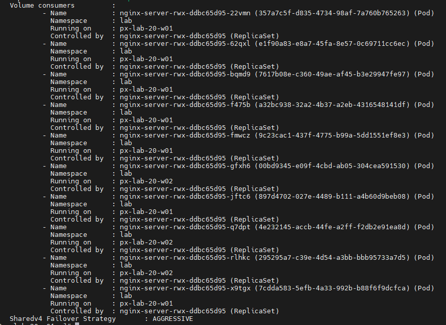

마지막으로 기존 RWO와 새 RWX 애플리케이션을 함께 비교합니다.

```bash
curl http://web.xx.px.lab
curl http://rwx-web.xx.px.lab
```
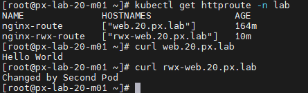

`web.xx.px.lab`은 기존 RWO 볼륨의 `Hello World`, `rwx-web.xx.px.lab`은 RWX 볼륨의 `Changed by Second Pod`를 반환합니다.


### Task 3. Portworx BBQ 설치

1. Helm과 Portworx CSI StorageClass를 확인합니다.

```bash
helm version
kubectl get storageclass px-csi-db
```

2. SUSE Helm 저장소를 추가합니다.

```bash
helm repo add suse-lab-setup https://opensource.suse.com/lab-setup
helm repo update
helm search repo suse-lab-setup/portworx-bbq
```
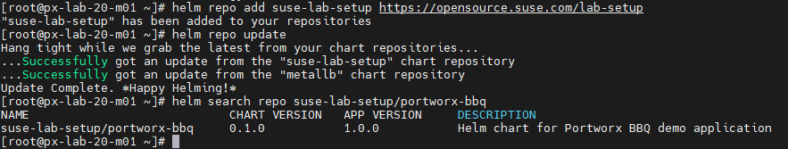

3. BBQ 설정 파일을 생성합니다.

```bash
cat <<'EOF' > ~/px-bbq-values.yaml
front:
  name: pxbbq-web
  image: eshanks16/pxbbq
  tag: v2
  replicaCount: 3
  containerPort: 8080
  healthEndpoint: /healthz
  host: ""
  port: 80
  db:
    host: portworx-bbq-mongodb
    port: "27017"
    username: root
    userpwd: root-password
    tls: ""

ingress:
  enabled: false

mongodb:
  enabled: true
  auth:
    rootPassword: root-password
    username: porxie
    password: porxie-password
    database: admin
  persistence:
    enabled: true
    storageClass: px-csi-db
    size: 8Gi
  image:
    registry: docker.io
    repository: bitnamilegacy/mongodb
    tag: 7.0.14-debian-12-r3
EOF
```

4. Portworx BBQ를 설치하고 상태를 확인합니다.

```bash
helm upgrade --install portworx-bbq \
  suse-lab-setup/portworx-bbq \
  --namespace portworx-bbq \
  --create-namespace \
  -f ~/px-bbq-values.yaml

helm status portworx-bbq -n portworx-bbq
kubectl get pod,service,pvc -n portworx-bbq
```
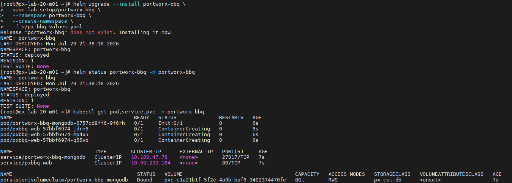

5. LAB 02의 NGINX Gateway에 BBQ용 HTTPRoute를 추가합니다.

> Note: `xx`를 자신의 LAB 번호로 변경합니다. 예: LAB 20은 `px-bbq.20.px.lab`입니다.

```bash
cat <<'EOF' > ~/px-bbq-route.yaml
apiVersion: gateway.networking.k8s.io/v1
kind: HTTPRoute
metadata:
  name: px-bbq
  namespace: portworx-bbq
spec:
  parentRefs:
    - name: nginx-gateway
      namespace: nginx-gateway
      sectionName: http
    - name: nginx-gateway
      namespace: nginx-gateway
      sectionName: https
  hostnames:
    - px-bbq.xx.px.lab
  rules:
    - backendRefs:
        - name: pxbbq-web
          port: 80
EOF
```

```
kubectl apply -f ~/px-bbq-route.yaml
kubectl get httproute -A
```

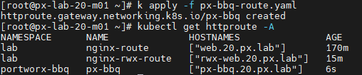

`xx`를 자신의 LAB 번호로 변경한 뒤 HTTP와 HTTPS 접속을 확인합니다.

```bash
curl px-bbq.xx.px.lab
```

웹 브라우저에서는 `https://px-bbq.xx.px.lab`에 접속합니다.

6. BBQ에서 데이터를 생성한 뒤 MongoDB Pod를 삭제하고 재배포합니다.
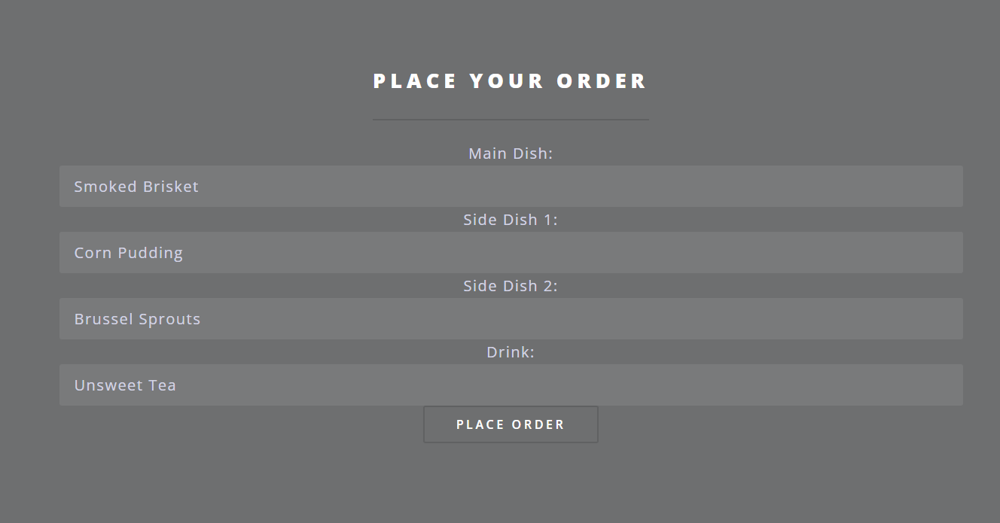
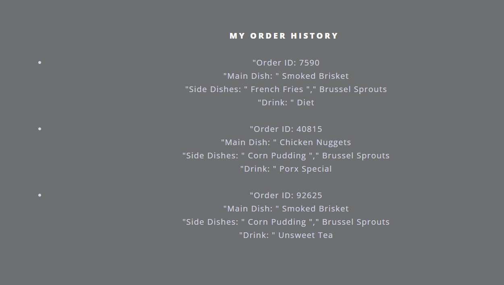
```bash
kubectl get pod -n portworx-bbq
kubectl delete pod <MONGODB_POD> -n portworx-bbq
watch -n 1 kubectl get pod portworx-bbq
```

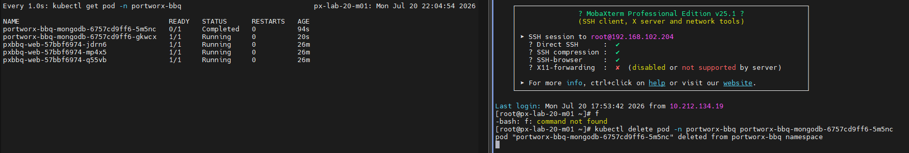

웹 페이지를 새로고침했을 때 데이터가 남아 있으면 MongoDB가 Portworx PVC를 정상적으로 사용하고 있는 것입니다.


---

[처음으로](../../README.md) | [이전 LAB](../lab-05/portworx-operations.md) | [다음 LAB](../lab-07/flasharray-integration.md)
