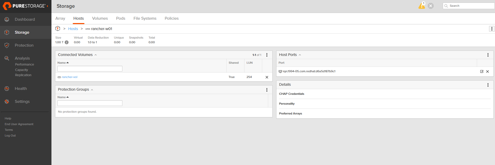
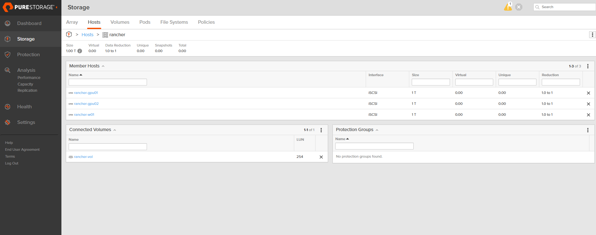

# Lab 07. Portworx와 Pure Storage FlashArray 연동

이 LAB에서는 Portworx가 Pure Storage FlashArray에 볼륨을 동적으로 생성하도록 iSCSI, Multipath, Secret과 StorageClass를 구성합니다.

> Note: 명령의 IP 주소, StorageCluster 이름과 API Token은 실습 환경의 값으로 변경합니다.

### Task 1. Portworx 노드의 iSCSI와 Multipath 구성

1. 모든 Portworx 워커 노드에서 iSCSI와 Multipath 패키지를 설치합니다.

```bash
dnf install -y iscsi-initiator-utils device-mapper-multipath
mpathconf --enable
systemctl enable --now iscsid multipathd
```

2. 각 워커 노드의 iSCSI Initiator IQN을 확인해 기록합니다.

```bash
cat /etc/iscsi/initiatorname.iscsi
```

출력 예시는 다음과 같습니다.

```text
InitiatorName=iqn.1994-05.com.redhat:xxxxxxxxxxxx
```

3. 각 워커 노드에서 `/etc/multipath.conf`를 엽니다.

```bash
vi /etc/multipath.conf
```

`defaults` 항목의 `user_friendly_names`를 `no`로 설정합니다.

```text
defaults {
    user_friendly_names no
}
```

4. Multipath 서비스를 다시 시작합니다.

```bash
systemctl restart multipathd
systemctl status iscsid multipathd --no-pager
```

> Note: `user_friendly_names no` 설정을 사용하면 장치가 `mpatha`가 아닌 WWID 이름으로 표시됩니다.

### Task 2. FlashArray Host와 iSCSI 연결 구성

1. FlashArray 관리 화면의 **Storage > Hosts**에서 각 워커 노드의 Host를 생성하고 Task 1에서 확인한 IQN을 등록합니다.

<p align="center"></p>

2. 워커 노드를 하나의 Host Group에 추가합니다.

<p align="center"></p>

3. 각 워커 노드에서 FlashArray iSCSI 데이터 포털을 검색합니다.

아래 IP는 실습 환경의 FlashArray iSCSI IP로 변경합니다.

```bash
FA_ISCSI_1="10.10.10.11"
FA_ISCSI_2="10.10.10.12"
FA_ISCSI_3="10.10.10.13"
FA_ISCSI_4="10.10.10.14"

iscsiadm -m discovery -t sendtargets -p "$FA_ISCSI_1"
iscsiadm -m discovery -t sendtargets -p "$FA_ISCSI_2"
iscsiadm -m discovery -t sendtargets -p "$FA_ISCSI_3"
iscsiadm -m discovery -t sendtargets -p "$FA_ISCSI_4"
```

4. 검색된 iSCSI Target에 로그인하고 세션을 확인합니다.

```bash
iscsiadm -m node --op update -n node.startup -v automatic
iscsiadm -m node --login
iscsiadm -m session
multipath -ll
```

> Note: 아직 FlashArray 볼륨을 생성하지 않았다면 `multipath -ll`에 새 장치가 표시되지 않을 수 있습니다.

### Task 3. FlashArray API Token과 Portworx Secret 생성

1. FlashArray 관리 화면에서 Portworx 연동용 사용자를 만들고 API Token을 생성합니다.

> Warning: API Token은 비밀번호와 같은 민감 정보입니다. 문서, 화면 캡처, Git 저장소와 셸 히스토리에 실제 값을 남기지 않습니다.

2. Portworx StorageCluster 이름을 확인합니다.

```bash
kubectl get storagecluster -n portworx
STC=$(kubectl get storagecluster -n portworx \
  -o jsonpath='{.items[0].metadata.name}')
echo "$STC"
```

3. StorageCluster에 FlashArray SAN 유형을 추가합니다.

```bash
kubectl edit storagecluster -n portworx "$STC"
```

기존 `spec.env`가 있으면 아래 항목만 추가합니다.

```yaml
spec:
  env:
    - name: PURE_FLASHARRAY_SAN_TYPE
      value: "ISCSI"
```

4. FlashArray 접속 정보를 작성합니다.

```bash
vi ~/pure.json
```

```json
{
  "FlashArrays": [
    {
      "MgmtEndPoint": "FLASHARRAY_MGMT_IP",
      "APIToken": "PURE_API_TOKEN"
    }
  ]
}
```

5. `FLASHARRAY_MGMT_IP`와 `PURE_API_TOKEN`을 실제 값으로 변경한 뒤 Kubernetes Secret을 생성합니다.

```bash
kubectl create secret generic px-pure-secret \
  -n portworx \
  --from-file=pure.json=~/pure.json \
  --dry-run=client -o yaml | kubectl apply -f -

kubectl get secret px-pure-secret -n portworx
rm -f ~/pure.json
```

> Note: `kubectl describe secret`은 실제 값 대신 데이터 항목과 크기만 표시합니다.

### Task 4. Portworx 서비스 재시작

1. 재시작 전에 Portworx 클러스터가 정상인지 확인합니다.

```bash
pxctl1 status
kubectl get pod -n portworx -l name=portworx -o wide
```

2. 모든 Portworx 노드의 서비스를 재시작합니다.

> Warning: 이 작업은 Portworx 서비스를 재시작합니다. 운영 환경에서는 유지보수 시간을 확보하고 애플리케이션 영향을 먼저 확인합니다.

```bash
kubectl label nodes --all px/service=restart --overwrite
kubectl get pod -n portworx -l name=portworx -w
```

3. 모든 Portworx Pod가 다시 `Running` 상태가 되면 클러스터 상태를 확인합니다.

```bash
pxctl1 status
kubectl get storagecluster -n portworx "$STC" -o yaml \
  | grep -A2 PURE_FLASHARRAY_SAN_TYPE
```

### Task 5. FlashArray StorageClass와 PVC 생성

1. FlashArray용 StorageClass를 생성합니다.

```bash
cat <<'EOF' > ~/flasharray-sc.yaml
apiVersion: storage.k8s.io/v1
kind: StorageClass
metadata:
  name: flasharray-sc
provisioner: pxd.portworx.com
parameters:
  backend: "pure_block"
  pure_secret_name: px-pure-secret
  pure_secret_namespace: portworx
  repl: "1"
  fs: "ext4"
reclaimPolicy: Delete
volumeBindingMode: Immediate
allowVolumeExpansion: true
EOF

kubectl apply -f ~/flasharray-sc.yaml
kubectl describe storageclass flasharray-sc
```

2. 테스트 네임스페이스와 PVC를 생성합니다.

```bash
cat <<'EOF' > ~/flasharray-test.yaml
apiVersion: v1
kind: Namespace
metadata:
  name: fa-test
---
apiVersion: v1
kind: PersistentVolumeClaim
metadata:
  name: test-fa
  namespace: fa-test
spec:
  storageClassName: flasharray-sc
  accessModes:
    - ReadWriteOnce
  resources:
    requests:
      storage: 10Gi
EOF

kubectl apply -f ~/flasharray-test.yaml
kubectl get pvc,pv -n fa-test
```

PVC가 `Bound` 상태가 되고 FlashArray 관리 화면에 10GiB 볼륨이 동적으로 생성되는지 확인합니다.

### Task 6. 테스트 Pod에서 볼륨 확인

1. PVC를 사용하는 NGINX Pod를 생성합니다.

```bash
cat <<'EOF' > ~/flasharray-test-pod.yaml
apiVersion: v1
kind: Pod
metadata:
  name: fa-test-pod
  namespace: fa-test
spec:
  containers:
    - name: nginx
      image: nginx:alpine
      volumeMounts:
        - name: fa-vol
          mountPath: /data
  volumes:
    - name: fa-vol
      persistentVolumeClaim:
        claimName: test-fa
EOF

kubectl apply -f ~/flasharray-test-pod.yaml
kubectl wait -n fa-test --for=condition=Ready \
  pod/fa-test-pod --timeout=180s
kubectl get pod -n fa-test -o wide
```

2. 테스트 파일을 생성하고 확인합니다.

```bash
kubectl exec -n fa-test fa-test-pod -- \
  sh -c 'echo "FlashArray volume test" > /data/test.txt'
kubectl exec -n fa-test fa-test-pod -- cat /data/test.txt
```

3. Pod가 실행 중인 워커 노드에서 Multipath 장치를 확인합니다.

```bash
multipath -ll
```

새 10GiB 장치가 여러 iSCSI 경로와 WWID 이름으로 표시되는지 확인합니다.

4. Pod를 다시 생성한 뒤 데이터가 유지되는지 확인합니다.

```bash
kubectl delete pod -n fa-test fa-test-pod
kubectl apply -f ~/flasharray-test-pod.yaml
kubectl wait -n fa-test --for=condition=Ready \
  pod/fa-test-pod --timeout=180s
kubectl exec -n fa-test fa-test-pod -- cat /data/test.txt
```

### 선택 사항. 테스트 리소스 정리

```bash
kubectl delete -f ~/flasharray-test-pod.yaml
kubectl delete -f ~/flasharray-test.yaml
kubectl delete -f ~/flasharray-sc.yaml
```

> Warning: `reclaimPolicy: Delete`이므로 PVC를 삭제하면 FlashArray의 테스트 볼륨도 삭제됩니다.

> Note: FlashArray를 Portworx의 동적 백엔드로 사용할 때는 미리 만든 SAN 볼륨을 `pxctl service drive add`로 스토리지 풀에 직접 추가하지 않습니다.

---

[처음으로](../../README.md) | [이전 LAB](../lab-06/nginx-lab02-rwo-rwx-bbq.md)
