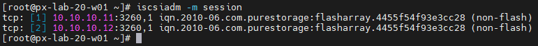
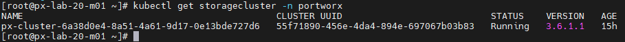

# Lab 07. Portworx와 Pure Storage FlashArray 연동

이 LAB에서는 Portworx가 Pure Storage FlashArray에 볼륨을 동적으로 생성하도록 iSCSI, Multipath, Secret과 StorageClass를 구성합니다.
FlashArray에 생성된 볼륨을 쿠버네티스 PVC와 Pod에 연결하고 데이터 입출력이 정상인지 확인합니다.

> Note: 명령의 IP 주소, StorageCluster 이름과 API Token은 실습 환경의 값으로 변경합니다.

### Task 1. Portworx 노드의 iSCSI와 Multipath 구성

1. 모든 Portworx 워커 노드에서 iSCSI와 Multipath 패키지를 설치합니다.

```bash
dnf install -y iscsi-initiator-utils device-mapper-multipath
mpathconf --enable
systemctl enable --now iscsid multipathd
```

2. 각 워커 노드의 iSCSI Initiator IQN을 확인해 기록합니다.

```bash
cat /etc/iscsi/initiatorname.iscsi
```

출력 예시는 다음과 같습니다.

```text
InitiatorName=iqn.1994-05.com.redhat:xxxxxxxxxxxx
```

3. 각 워커 노드에서 `/etc/multipath.conf`를 엽니다.

```bash
vi /etc/multipath.conf
```

`defaults` 항목의 `user_friendly_names`를 `no`로 설정합니다.

```text
defaults {
    user_friendly_names no
}
```

4. Multipath 서비스를 다시 시작합니다.

```bash
systemctl restart multipathd
systemctl status iscsid multipathd --no-pager
```

> Note: `user_friendly_names no` 설정을 사용하면 장치가 `mpatha`가 아닌 WWID 이름으로 표시됩니다.

### Task 2. FlashArray iSCSI 연결 준비

1. Task 1에서 확인한 IQN이 워커 노드마다 서로 다른지 비교합니다.

> Note: FlashArray Direct Access에서는 Portworx가 애플리케이션 Pod의 볼륨 연결 상태에 따라 FlashArray Host와 IQN 매핑을 동적으로 관리합니다. FlashArray 관리 화면에서 Host 또는 Host Group을 미리 생성하지 않습니다.

2. 각 워커 노드에서 FlashArray iSCSI 데이터 포털을 검색합니다.

```bash
iscsiadm -m discovery -t sendtargets -p 10.10.10.11
```

3. 검색된 iSCSI Target에 로그인하고 세션을 확인합니다.

```bash
iscsiadm -m node --op update -n node.startup -v automatic
iscsiadm -m node -l
iscsiadm -m session
multipath -ll
```



> Note: 아직 FlashArray 볼륨을 생성하지 않았다면 `multipath -ll`에 새 장치가 표시되지 않을 수 있습니다.

### Task 3. FlashArray API Token과 Portworx Secret 생성

1. FlashArray 관리 화면에서 `Storage Admin` 역할의 Portworx 연동용 사용자를 만들고 API Token을 생성합니다.

> Warning: API Token은 비밀번호와 같은 민감 정보입니다. 문서, 화면 캡처, Git 저장소와 셸 히스토리에 실제 값을 남기지 않습니다.

2. Portworx StorageCluster 이름을 확인합니다.

```bash
kubectl get storagecluster -n portworx
```


3. StorageCluster에 FlashArray SAN 유형과 Cloud Provider 자격증명 저장소를 추가합니다.

```bash
kubectl patch storagecluster \
  <STORAGECLUSTER_NAME> \
  -n portworx \
  --type merge \
  -p '{"spec":{"secretProviderPerFeature":{"cloudProviderCred":"k8s"},"env":[{"name":"PURE_FLASHARRAY_SAN_TYPE","value":"ISCSI"}]}}'
```

> Note: 이 설정이 없으면 FlashArray 자격증명을 Vault에서 조회하려고 시도하면서 `StorageCluster secretsProvider is 'k8s', not 'vault'` 오류가 발생할 수 있습니다. `cloudProviderCred: k8s`를 명시하면 Portworx가 `px-pure-secret`에서 FlashArray API Token을 조회합니다.

설정이 반영되었는지 확인합니다.

```bash
kubectl get storagecluster -n portworx <STORAGECLUSTER_NAME> -o yaml \
  | grep -A2 secretProviderPerFeature

kubectl get storagecluster -n portworx <STORAGECLUSTER_NAME> -o yaml \
  | grep -A1 PURE_FLASHARRAY_SAN_TYPE
```

4. FlashArray 접속 정보를 작성합니다.

```bash
cat << 'EOF' > pure.json
{
  "FlashArrays": [
    {
      "MgmtEndPoint": "192.168.100.231",
      "APIToken": "<PURE_API_TOKEN>"
    }
  ]
}
EOF
```

5. `FLASHARRAY_MGMT_IP`와 `PURE_API_TOKEN`을 실제 값으로 변경한 뒤 Kubernetes Secret을 생성합니다.

```bash
kubectl create secret generic px-pure-secret --namespace portworx --from-file=pure.json

kubectl get secret px-pure-secret -n portworx
rm -f ~/pure.json
```

> Note: Kubernetes Secret 방식을 사용할 때 Secret 이름은 반드시 `px-pure-secret`이어야 하며 Portworx와 같은 네임스페이스에 생성해야 합니다. Portworx가 이 Secret을 자동으로 조회하므로 StorageClass에 Secret 이름과 네임스페이스를 별도로 지정하지 않습니다.
>
> Note: `kubectl describe secret`은 실제 값 대신 데이터 항목과 크기만 표시합니다.

### Task 4. Portworx 서비스 재시작

1. 재시작 전에 Portworx 클러스터가 정상인지 확인합니다.

```bash
pxctl1 status
kubectl get pod -n portworx -l name=portworx -o wide
```

2. 모든 Portworx 노드의 서비스를 재시작합니다.

> Warning: 이 작업은 Portworx 서비스를 재시작합니다. 운영 환경에서는 유지보수 시간을 확보하고 애플리케이션 영향을 먼저 확인합니다.

```bash
kubectl label nodes --all px/service=restart --overwrite
kubectl get pod -n portworx -l name=portworx -w
```

3. 모든 Portworx Pod가 다시 `Running` 상태가 되면 클러스터 상태를 확인합니다.

```bash
pxctl1 status
kubectl get storagecluster -n portworx <STORAGECLUSTER_NAME> -o yaml \
  | grep -A2 PURE_FLASHARRAY_SAN_TYPE
```

### Task 5. FlashArray StorageClass와 PVC 생성

1. FlashArray용 StorageClass를 생성합니다.

```bash
cat <<'EOF' > ~/flasharray-sc.yaml
apiVersion: storage.k8s.io/v1
kind: StorageClass
metadata:
  name: flasharray-sc
provisioner: pxd.portworx.com
parameters:
  backend: "pure_block"
reclaimPolicy: Delete
volumeBindingMode: Immediate
allowVolumeExpansion: true
EOF

kubectl apply -f ~/flasharray-sc.yaml
kubectl describe storageclass flasharray-sc
```

2. 테스트 네임스페이스와 PVC를 생성합니다.

```bash
cat <<'EOF' > ~/flasharray-test.yaml
apiVersion: v1
kind: Namespace
metadata:
  name: fa-test
---
apiVersion: v1
kind: PersistentVolumeClaim
metadata:
  name: test-fa
  namespace: fa-test
spec:
  storageClassName: flasharray-sc
  accessModes:
    - ReadWriteOnce
  resources:
    requests:
      storage: 10Gi
EOF

kubectl apply -f ~/flasharray-test.yaml
kubectl get pvc,pv -n fa-test
```

PVC가 `Bound` 상태가 되고 FlashArray 관리 화면에 10GiB 볼륨이 동적으로 생성되는지 확인합니다.

### Task 6. Deployment를 이용한 노드 간 볼륨 이동 확인

1. PVC를 사용하는 NGINX Deployment를 생성합니다.

```bash
cat <<'EOF' > ~/flasharray-test-deployment.yaml
apiVersion: apps/v1
kind: Deployment
metadata:
  name: fa-test
  namespace: fa-test
spec:
  replicas: 1
  strategy:
    type: Recreate
  selector:
    matchLabels:
      app: fa-test
  template:
    metadata:
      labels:
        app: fa-test
    spec:
      containers:
        - name: nginx
          image: nginx:alpine
          volumeMounts:
            - name: fa-vol
              mountPath: /data
      volumes:
        - name: fa-vol
          persistentVolumeClaim:
            claimName: test-fa
EOF

kubectl apply -f ~/flasharray-test-deployment.yaml
kubectl wait -n fa-test --for=condition=Ready \
  pod -l app=fa-test --timeout=180s
kubectl get pod -n fa-test -l app=fa-test -o wide
```

출력에서 현재 `<POD_NAME>`과 `<CURRENT_NODE>`를 확인합니다.

2. 현재 Pod에 테스트 파일을 생성하고 확인합니다.

```bash
kubectl exec -n fa-test <POD_NAME> -- \
  sh -c 'echo "FlashArray volume test" > /data/test.txt'
kubectl exec -n fa-test <POD_NAME> -- cat /data/test.txt
```

3. Pod가 실행 중인 워커 노드에서 Multipath 장치를 확인합니다.

```bash
multipath -ll
```

새 10GiB 장치가 여러 iSCSI 경로와 WWID 이름으로 표시되는지 확인합니다.

4. FlashArray 관리 화면의 **Storage > Hosts**에서 Portworx가 현재 Pod 실행 노드의 Host와 IQN 매핑을 자동으로 생성했는지 확인합니다.

5. 현재 Pod가 실행 중인 노드를 스케줄링 대상에서 제외하고 Pod를 삭제합니다.

```bash
kubectl cordon <CURRENT_NODE>
kubectl delete pod -n fa-test <POD_NAME>
kubectl get pod -n fa-test -l app=fa-test -o wide -w
```

Deployment가 다른 워커 노드에 새 Pod를 생성할 때까지 기다린 뒤 `<NEW_POD_NAME>`과 새 노드를 확인합니다.

> Note: RWO 볼륨은 한 번에 하나의 노드에만 연결됩니다. 기존 노드에서 볼륨을 분리하고 새 노드에 연결하는 동안 새 Pod가 잠시 `ContainerCreating` 상태로 표시될 수 있습니다.

6. 새 Pod에서도 기존 데이터가 유지되는지 확인합니다.

```bash
kubectl exec -n fa-test <NEW_POD_NAME> -- cat /data/test.txt
```

7. FlashArray 관리 화면에서 기존 노드의 Host 매핑이 정리되고 새 노드의 Host와 IQN 매핑에 볼륨이 연결되었는지 확인합니다.

> Note: Portworx가 FlashArray Host와 IQN 매핑을 정리하더라도 워커 노드의 `/etc/iscsi/initiatorname.iscsi`에 저장된 IQN과 PVC 데이터는 삭제되지 않습니다.

8. 실습을 마친 뒤 기존 노드를 다시 스케줄링할 수 있도록 설정합니다.

```bash
kubectl uncordon <CURRENT_NODE>
```

## 참고 자료

- [Portworx와 Pure Storage FlashArray 연동](https://docs.portworx.com/portworx-enterprise/platform/install/pure-storage/flasharray)
- [Pure FlashArray Direct Access Volume](https://docs.portworx.com/portworx-enterprise/provision-storage/create-pvcs/pure-flasharray)
- [Portworx StorageClass 레퍼런스](https://docs.portworx.com/portworx-enterprise/reference/storageclass)

---

[처음으로](../../README.md) | [이전 LAB](../lab-06/nginx-lab02-rwo-rwx-bbq.md)
